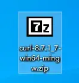
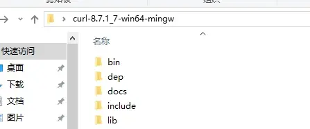
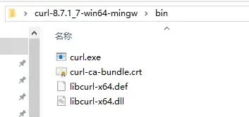
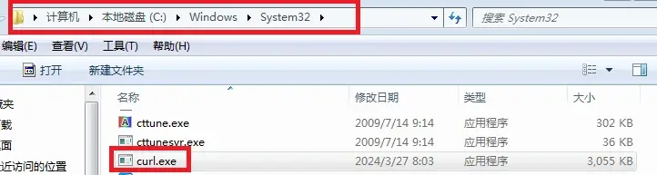
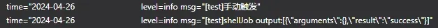
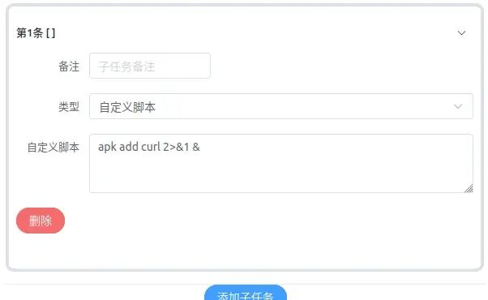
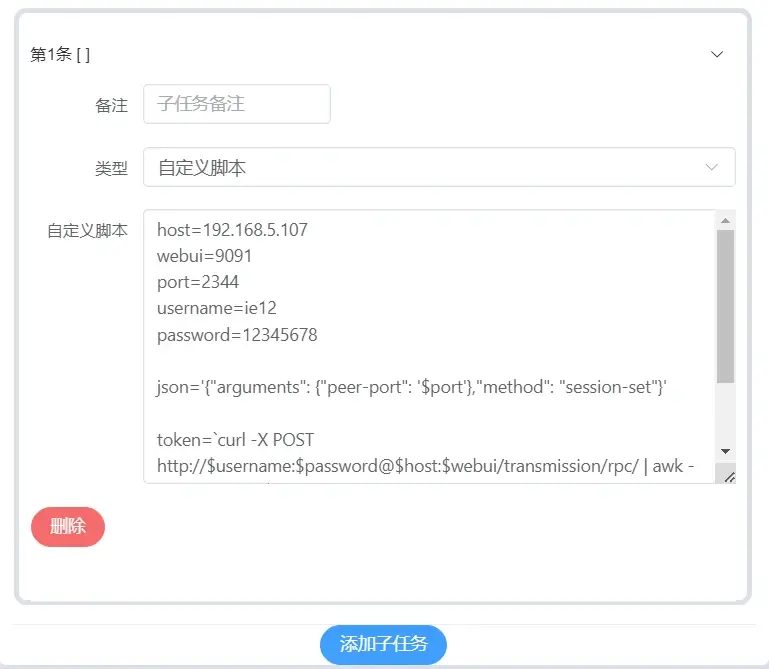

#「LUCKY STUN穿透」使用 cURL 自动修改 Transmission 的监听端口

## 关于本教程

在之前的教程中我们已经实现了使用lucky自带的webhook功能自动修改qbittorrent的端口  
[「LUCKY STUN穿透」使用 Webhook 自动修改 qbittorrent 的监听端口](./stun-qb端口自动化.md)  
在本教程中将讲解如何自动化的更换 transmission 的监听端口  

与之前 qBittorrent 的配置方法相比 transmission 的端口自动化要复杂一些  
**这主要是由于其强制开启跨站保护所导致的**  

该功能无法关闭 除非对源代码进行修改后再次编译  
考虑到transmission 运行在许多不同的平台 从新编译过于麻烦  

我们只能想办法通过它的跨站保护认证  
**但这样一来就无法通过lucky的webhook来实现了**  
**而需要使用到curl和自定义脚本**  

其实原理也很简单 就是先通过curl发起访问获取用于通过跨站检测的token  
然后将其加载到下一次用于更改端口号请求的头中以通过跨站保护检测  
Transmission webAPI文档：[链接](https://github.com/transmission/transmission/blob/main/docs/rpc-spec.md)  


本教程将分为Windows配置方法和Docker配置方法两部分进行讲解  
以lucky安装的位置为准  

lucky和 transmission可以不在一台机器或IP上  
若transmission或lucky在docker中运行则其网络必须为host  
感谢 [泥浆](https://space.bilibili.com/14913) 提供的命令支持  


---

## Windows配置方法

### 安装curl

win10和win11中应该已经预装了curl  
可以在命令提示符中输入下列命令查看是否安装  
若已安装会显示出curl的版本号(注意V要大写)  

```
curl -V
```


如果使用的是win7或显示  
"‘curl’ 不是内部或外部命令，也不是可运行的程序或批处理文件。"  
就需要手动下载curl 下载curl：[链接](https://curl.se/windows/)  






进入bin文件夹 将curl.exe 复制到到system32文件夹  
`C:\Windows\System32`  





完成后重复刚才的命令 有版本号显示即表示安装正确  


### 调整transmission设置

**关闭** transmission自己的UPnP以防止影响STUN穿透效果  


### 设置自动更新脚本

打开lucky添加计划任务  
在计划任务中测试完命令之后再填写到STUN穿透规则中  


子规则选择自定义脚本 其他选项任意设置  
不填写脚本内容**先保存计划任务**  


关闭规则开关 我们只使用手动触发  


编辑规则并填写下列命令  
其中的参数要根据实际情况填写  

```
chcp 65001

set "ip="
set "webport="
set "username="
set "password="
set "port="

set json={""arguments"": {""peer-port"": %port%},""method"": ""session-set""}

for /f "tokens=27 delims=<>" %%a in ('curl -X POST http://"%username%":"%password%"@"%ip%":"%webport%"/transmission/rpc/  -H "%authorization%"') do (
  set token=%%a
)

curl -X POST http://"%username%":"%password%"@"%ip%":"%webport%"/transmission/rpc/ -H "%token%" -d "%json%"
```

**参数解释**  

* IP 表示transmission所在设备的IP
* webport 表示transmission webUI的端口号
* username 表示登录 transmission 使用的用户名
* password 表示登录 transmission 使用的密码
* port 表示要更新的端口号 测试时可以使用任意端口号


**示例**  

```
chcp 65001

set "ip=127.0.0.1"
set "webport=9091"
set "username=ie12"
set "password=12345678"
set "port=5645"

set json={""arguments"": {""peer-port"": %port%},""method"": ""session-set""}

for /f "tokens=27 delims=<>" %%a in ('curl -X POST http://"%username%":"%password%"@"%ip%":"%webport%"/transmission/rpc/  -H "%authorization%"') do (
  set token=%%a
)

curl -X POST http://"%username%":"%password%"@"%ip%":"%webport%"/transmission/rpc/ -H "%token%" -d "%json%"
```


**填写完成后保存规则**  

按下手动触发按钮并查看日志显示 success 即表示成功  
不过最好还是去到transmission的设置中检查一下端口没有变化  
**若成功变更了端口则表示脚本设置正确**  



**如果有错误代码 且不显示具体内容**  
建议创建一个批处理文件 手动运行以查看报错内容  
记得在最后加上 pause  


**编辑STUN 穿透规则**  

将之前测试完成的脚本 复制到STUN的自定义脚本区域  
若在自定义脚本区域已经有命令则应按照流程顺序进行排列  
并使用vbs脚本设置间隔 [详情见之前的教程](./stun-bc端口自动化.md)  

将port选项的值替换为穿透端口变量  
```
set "port=${port}"
```

**示例**  


打开穿透规则 查看日志 以及 transmission 端口  
**若显示 success 且端口成功更换 则配置正确**  


## Docker 配置方法
思路和在Windows上一样 主要的区别在安装curl的方法和脚本的语法有所不同  
为容器安装curl时我们可以在终端环境中进行  
但更简单的方法是使用计划任务中的自定义脚本功能  


### 创建计划任务
创建方法和前文中相同  


### 更换软件包下载源
将下载源修改为 清华大学开源软件镜像站  
以防止因为网络问题造成安装失败  
填写下列命令并保存  

```
sed -i 's/dl-cdn.alpinelinux.org/mirrors.tuna.tsinghua.edu.cn/g' /etc/apk/repositories
```


**按下手动触发按钮并查看日志**  
此步的输出内容为空白  


### 安装curl  

替换为以下命令后 手动触发运行  
```
apk add curl 2>&1 &
```



检查日志输出 有显示OK表示安装成功  


**验证安装效果**  

替换为以下命令后 手动触发运行  
```
curl -V
```
检查日志 看到curl的版本号即表示成功  


### 调整transmission设置

**关闭** transmission自己的upnp以防止影响STUN穿透效果  


**测试脚本**  

docker（Linux）下的命令和Windows下的有较大不同但原理是一样的  
```
host=
webui=
port=
username=
password=

json='{"arguments": {"peer-port": '$port'},"method": "session-set"}'

token=`curl -X POST http://$username:$password@$host:$webui/transmission/rpc/ | awk -F '[<>]' '{print$(NF-4)}'`
curl -X POST http://$username:$password@$host:$webui/transmission/rpc/  -H "$token" -d "$json"
```

**参数解释**  

* host 表示transmission所在设备的IP
* webui 表示transmission webUI的端口号
* port 表示要更新的端口号 测试时可以使用任意端口号
* username 表示登录 transmission 使用的用户名
* password 表示登录 transmission 使用的密码


**注意在docker中 127.0.0.1 可能不起作用**  
建议直接使用宿主机的IP地址或 `host.docker.internal` 加以替代  
详见：[链接](https://stackoverflow.com/questions/24319662/from-inside-of-a-docker-container-how-do-i-connect-to-the-localhost-of-the-mach)  


**示例**  

```
host=192.168.5.107
webui=9091
port=5678
username=ie12
password=12345678

json='{"arguments": {"peer-port": '$port'},"method": "session-set"}'

token=`curl -X POST http://$username:$password@$host:$webui/transmission/rpc/ | awk -F '[<>]' '{print$(NF-4)}'`
curl -X POST http://$username:$password@$host:$webui/transmission/rpc/  -H "$token" -d "$json"
```



**填写完成后保存规则**  

按下手动触发按钮并查看日志显示 success 即表示成功  
不过最好还是去到transmission的设置中检查一下端口没有变化  
**若成功变更了端口则表示脚本设置正确**  


### 编辑STUN 穿透规则

将之前测试完成的脚本 复制到STUN的自定义脚本区域  
若在自定义脚本区域已经有命令则应按照流程顺序进行排列  
**并使用sleep设置间隔**  

将port选项的值替换为穿透端口变量
```
port=${port}
```

**示例**  


打开穿透规则 查看日志 以及 transmission 端口  
**若显示 success 且端口成功更换 则配置正确**  
**至此我们实现了使用 cURL 自动修改 transmission 的监听端口**  


