# 使用SVCB/HTTPS记录隐藏和固定Web服务端口

## 背景

在之前的教程中我们实现了使用 重定向 来 “固定” stun穿透后web服务的端口  
其主要的效果是 **在访问穿透后的web服务时免除输入端口**  
这个方法不仅适用于stun穿透 **也适合运行在IPv6非常规端口上的web服务**  

有关什么是 “隐藏端口” 的问题详见之前的教程 此处不再进行解释：  
[「LUCKY STUN穿透」使用Cloudflare的页面规则固定和隐藏网页端口](./stun-web服务-CF.md)  
[「扩展篇」使用Cloudflare的重定向规则传递资源路径和查询字符串](./stun-cf重定向.md)  

## 重定向方案

在之前的教程中使用的都是**重定向方案**  
即需要一台开放端口的服务器加以辅助  

在地址栏中输入并访问的地址 是辅助服务器的地址  
访问后辅助服务器发送重定向响应 指向实际访问的服务及其端口  
**事实上重定向还有显性和隐性之分**  

### 显性重定向

在之前的教程中使用的重定向其实都是 **显性重定向**  
即在浏览器地址栏中可以看到重定向前后地址的变化  

这种方案除了会在浏览器地址栏中看到地址或端口变化外 其实没有太大的缺点  
兼容性相对较好 重定向对于http来说是非常基本的操作  

有些网页服务有专属的APP 以提供更好的服务效果  
但这些APP大都不支持重定向 不过这种适配对APP来说起来相对简单  

### 隐性重定向

隐性重定向 相比起 显性重定向 最直观的区别就是  
浏览器地址栏中的地址不会发生变化  

其实这个所谓的隐性重定向 **使用的是iframe框架元素** 而非真正的重定向  
这个iframe元素能够将另一个 HTML 页面嵌入到当前页面中  
**简单来说就在当前页面里面又插入了网页**  

其有些类似于Windows中的嵌套窗口  
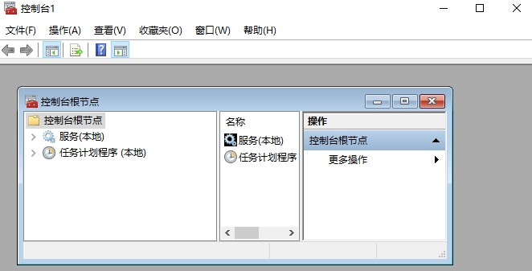

当然地址栏的变化并没有消失  
其只是从浏览器的地址栏中转移到了iframe框架的地址栏中  
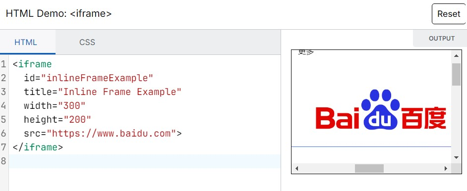

相比其显性重定向 隐性重定向的兼容性其实更差  
一些元素和网页可能不被允许镶嵌在iframe框架框架中  
而对于APP来说兼容和适配更无可能 因为iframe框架只能用于浏览器显示  


## SVCB/HTTPS 记录 

这个SVCB记录与之前教程中介绍过的SRV记录有些相似  
**可以使用DNS记录来指示 服务所运行的端口**  

SRV记录（[RFC 2782](https://datatracker.ietf.org/doc/html/rfc2782)）早在2000年就完成标准化  
而SVCB记录则2023年才完成标准化([RFC 9461](https://datatracker.ietf.org/doc/html/rfc9461)和[RFC 9460](https://datatracker.ietf.org/doc/html/rfc9460))  

SVCB记录所提能供的服务远比SRV要多 其不仅仅用于指示服务端口  
不过在本教程中 主要使用其来“隐藏”WEB服务的端口  

**HTTPS是SVCB记录中的一种 专门用于指示HTTPS服务参数**  
在设置/查询记录类型的时候需要注意区分  


**一般工作流程**  

1. 客户端同时发起 A/AAAA 和 HTTPS 记录（增加 50% 的查询量）  
2. 如果 HTTPS 记录是别名模式，则需要查询指向域名的 A/AAAA 和 HTTPS 记录  
3. 客户端需要查询服务模式下目标域名的 A/AAAA 记录  
4. DNS 递归解析服务器可以通过附加字段提供这些记录  

ECH 记录的特殊要求：  
客户端需要在收到 HTTPS 查询结果之后再发起 TLS 连接，以防服务端开启 ECH  
如果 HTTPS 查询超时，客户端不能假设服务端不支持 ECH，以防降级攻击  

与之前的重定向方案相比 使用HTTPS记录无需 开放端口的服务器支持  
其相当于一个 “无源” 方案 更适合那些不提供重定向/URL转发功能的DNS提供商  
而且未来APP的适配也相对容易 先发https查询 再根据返回发起https连接  


---

## 浏览器支持问题

由于SVCB记录是一个非常新的记录类型  
目前占绝对主流的Chrome浏览器尚不支持（2025.8）  
不过火狐浏览器（v89+）和苹果的Safari浏览器已经支持  

由于缺乏苹果设备 故无法测试 SVCB/HTTPS记录在Safari浏览器上的支持情况  
但一些文章中的测试 显示 至少在 IOS16中的Safari浏览器就已经支持且不需要任何特殊设置  

由于Safari浏览器只能运行在IOS或 MAC OS 上即无法非苹果设备设备上使用  
**故本教程之后的内容将主要讲解使用火狐浏览器访问的方法**  

---

## 设置 SVCB记录

由于是较新的记录类型 目前并非所有DNS服务商都提供SVCB/HTTP记录  
这里使用的是cloudflare （下文简称CF） 国内的提供商中腾讯云和阿里云都已经支持SVCB了  


### 添加传统记录

这里的传统记录指的是 A或AAAA记录 也就是IPv4或IPv6解析  
同时关闭CF的代理功能（小云朵） 记录的名称可自定义 这里使用的是 svcb  
(在域名中使用https似乎会有奇怪的问题)  

这里使用 `ie12.com`作为示例域名  
填写完成后的 IPv4记录 即为 `svcb.ie12.com`  

**示例**  
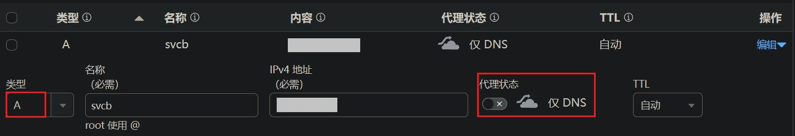

### 添加HTTPS记录

HTTPS记录也是支持泛域名解析的 例如 `XXX.svcb.ie12.com`  
对应之前教程中stun跳转后的域名 `XXX.stun.ie12.com`
这里为了方便演示 没有使用泛域名  

**示例**  
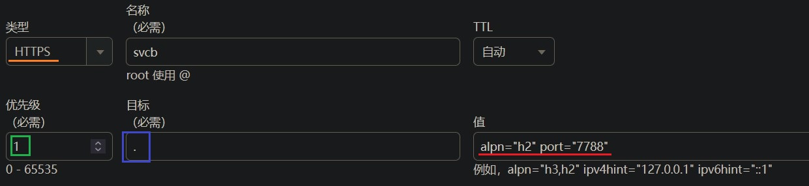

**类型** 选择 HTTPS  
名称应与之前设置的传统记录名称相同  

**优先级** 应大于0  
0 表示别名模式 相当于传统记录中的 cname  
1-65535 表示服务模式 也是我们需要的模式  

**目标** 填写一个英文状态下的句号  
表示指向自身 因为用的是服务模式  
如果是别名模式 则填写需要指向的域名  

**值** 部分是最重要的 web服务的端口号需要填写在这里  
填写 `port="实际服务端口"`  

还可以填写服务器使用的http版本号  
如果使用lucky做反向代理的话 默认应该为 http2  
填写 `alpn="h2"` 两个参数之间用空格隔开  

此选项还有助于浏览器直接发起http3请求（QUIC）  
而不需要先通过http2探测服务端是否支持 不过此处我们不需要该功能  

**IP提示选项**  

即示例中的 IPv4hint 和IPv6hint   
从理论上来讲其可以用于加速 dns 解析过程  
即当 HTTPS 记录含有 IP 提示信息时 可以不用再查询目标域名的IP地址  

但目前仍然需要有传统记录指示IP 浏览器才会尝试进行SVCB查询  
这可能是火狐浏览器的特性造成的 就目前的情况 该选项无实际作用  


### 检视解析效果

目前Windows上无法完成SVCB或者HTTPS的查询  
Linux上也需要专门的DNS查询软件  

这里直接使用在线的HTTPS记录查询：[链接](https://www.nslookup.io/https-lookup/)  
输入之前设置的域名 点击查询 应可以看到填写到值中的内容  

**示例**  

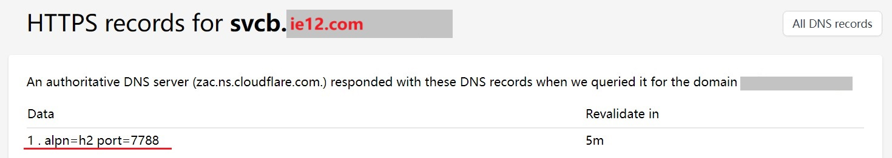
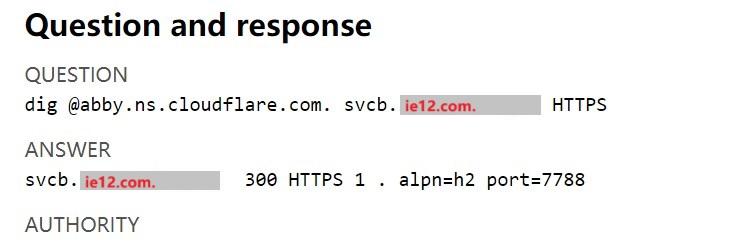

---

## 设置火狐浏览器

### 开启 DoH 功能

目前（v141）要让火狐浏览器使用HTTPS记录  
需要启用内置的 DoH DNS 功能  

打开 设置》隐私与安全》基于HTTPS的DNS启用策略  
将安全等级设置到 **增强保护或更高** 不然火狐基本不会使用 DoH 查询功能  

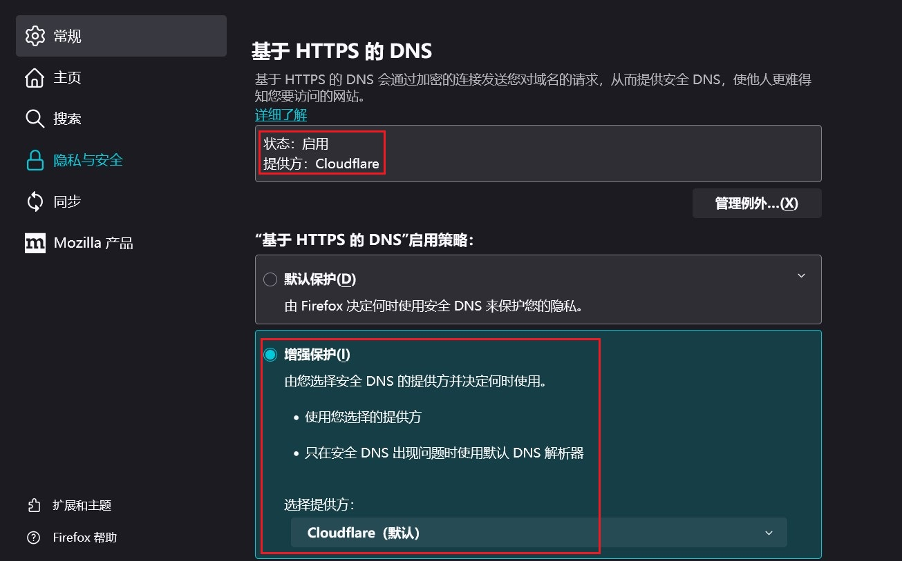

默认使用 cloudflare 的DoH 其在国内的连接效果可能不佳  
可以更换成国内的 DoH 服务  

```
# 360
https://doh.360.cn/dns-query	

# 阿里
https://dns.alidns.com/dns-query

# 腾讯
https://doh.pub/dns-query
```


**示例**  
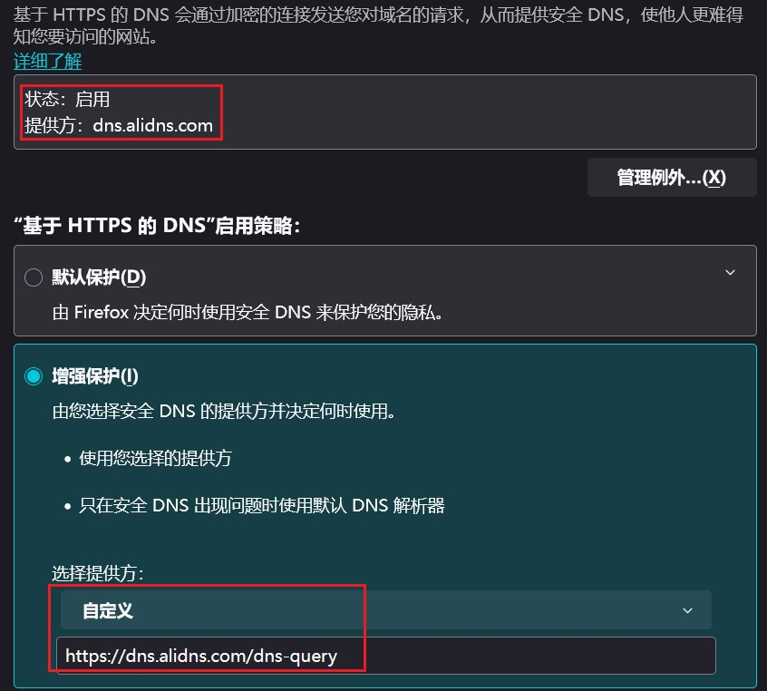


### 测试 DoH 查询工作状况

DoH 查询的工作状态不太好直接观察 这里使用间接测试方法  
通过 运行 ECH 测试的方法来进行间接 测试  

(其实在F12里面看DNS解析这一项就行了)  
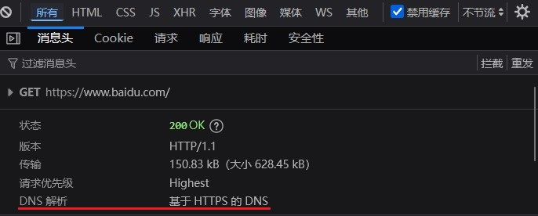

ECH (Encrypted Client Hello) 加密客户端  
其用于加密TLS握手消息 此处不做过多介绍  

其在火狐 v119 版本后就默认开启了  
也需要依赖DoH功能 若ECH测试通过则表明 DoH也已经启用  


ECH 测试网站：  

* https://tls-ech.dev/
* https://www.cloudflare.com/zh-cn/ssl/encrypted-sni/


通过上述设置后 应该可以通过ECH测试  

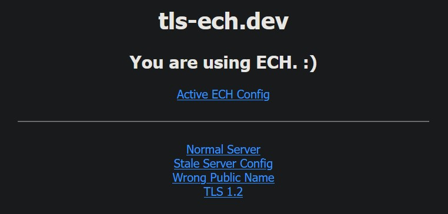
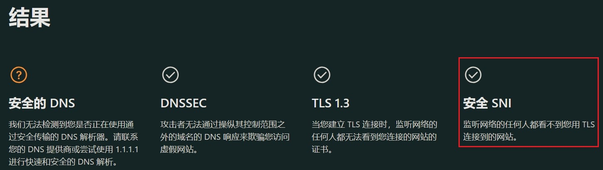


### 火狐浏览器代理问题

**若在没有使用代理则此部分可忽略**  

在火狐中 **使用系统代理** 的情况下 似乎无法使用DoH查询 这可能和UDP有关  
Windows的系统代理设置 可能相当于一个socks4代理 其是不支持UDP的  

选择 **手动配置代理 使用socks5代理** 可以解决此问题  
socks5 协议支持UDP 当然上游服务器也需要支持UDP  
**但是不要勾选 使用代理查询DNS**  

这同样会造成DOH失效 具体原因尚不明确  
可能是火狐自身的一些特性造成的  

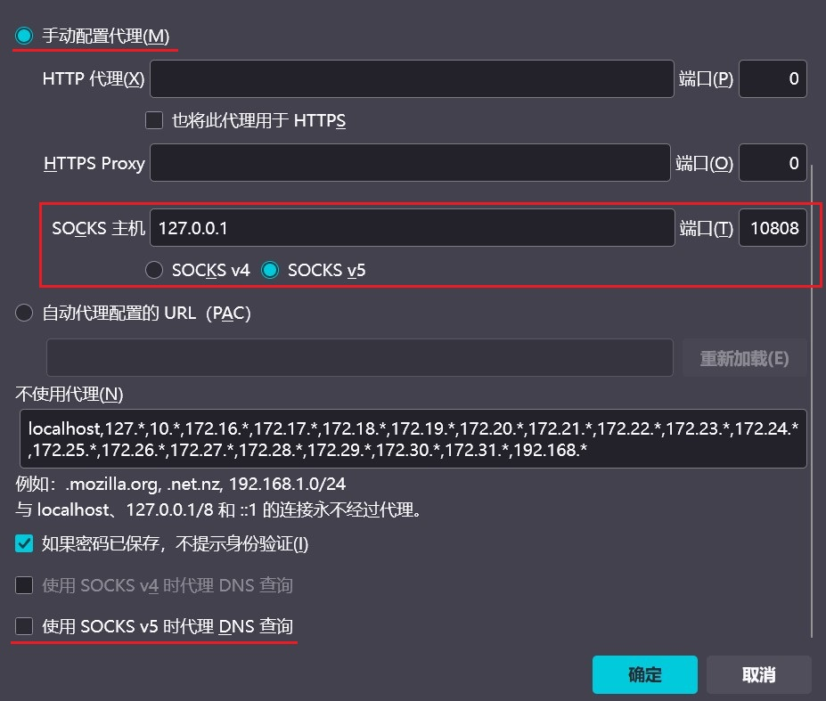

---

## 测试访问效果

在完成HTTPS记录的添加和火狐浏览器设置后  
开始测试访问效果  

若按照之前的教程设置了lucky反向代理或重定向固定端口  
则需要新的域名 添加到web服务规则中的 **前端地址** 内  
这里为了方便演示 使用了单域名 并设置了独立的web服务规则  

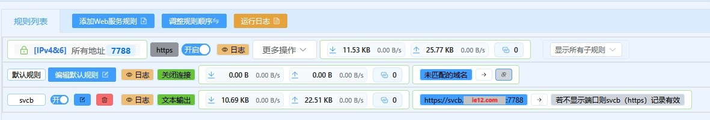


### 附加端口访问

**输入域名并附加端口进行访问**  
此步骤用于验证 web服务本身是否可用  
以防止 如端口未打开 域名输入错误等其他原因影响访问  

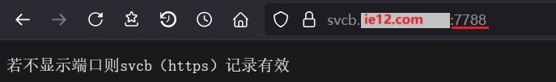

### 删除端口后访问

在附加端口访问成功后 即可尝试删除端口访问  
若上述设置均正确 则删除端口后依然可以访问  

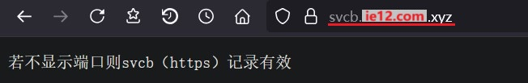


### 更新HTTPS记录

使用lucky更新 HTTPS 记录的方法和之前更新SRV记录时基本相同  
依然可以使用全局变量来动态引用STUN穿透后获得的端口  

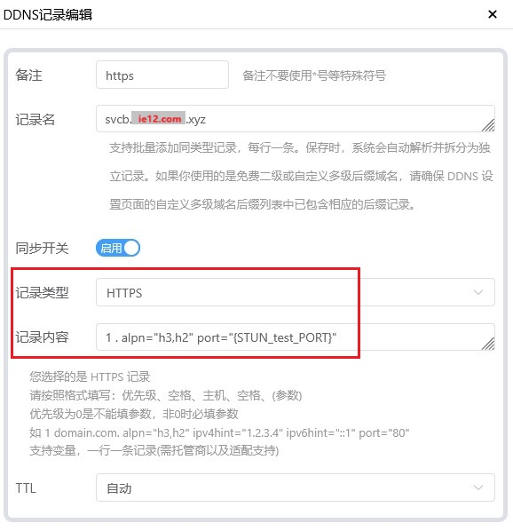
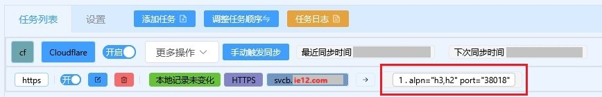

第一项为 **优先级** 这里填写的是1  
第二项为 **目标** 因为是服务模式 指向的是自身 故填写的是点  
之后便是 值 的内容 与之前在cf控制台中填写的保持一致  
此处还使用了动态的stun全局变量替换静态的具体值  

---

## 故障排除

目前让Firefox使用 HTTPS记录 的条件：  

* 更新火狐浏览器到最新版本  
* 启用火狐内置的DoH查询 并保证其可以工作  
* 火狐浏览器中未设置使用系统代理  
 或设置手动socks5代理 但未勾选使用代理查询DNS  
* 所访问的域名在其443端口上没有任何服务  
 若在443端口上已有服务 则会直接显示443端口上的服务  

---

## 火狐安卓版配置

目前火狐的安卓版本也已经可以使用HTTPS记录  
与Windows上不同的是 目前安卓版本的火狐内置的DoH查询功能  
好在其可以使用系统设置中的DoH 设置系统DoH后即可使用HTTPS记录  

不同品牌的设备 对其的称呼也不同  
如 加密DNS、安全DNS、私人/私有DNS  
可以直接在系统设置中使用 DNS 为关键字 进行搜索  

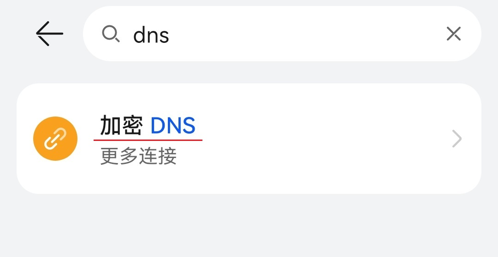
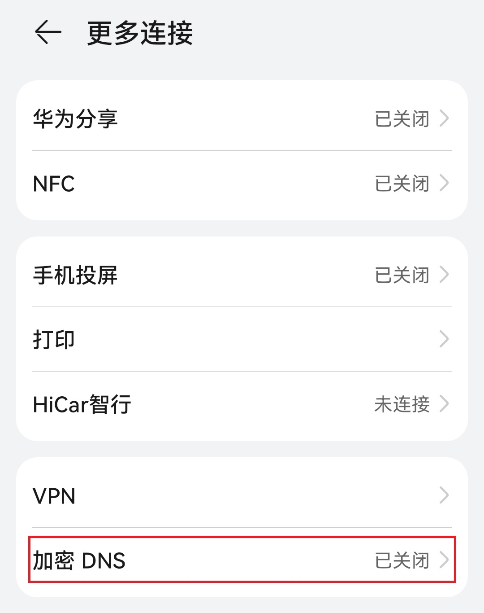
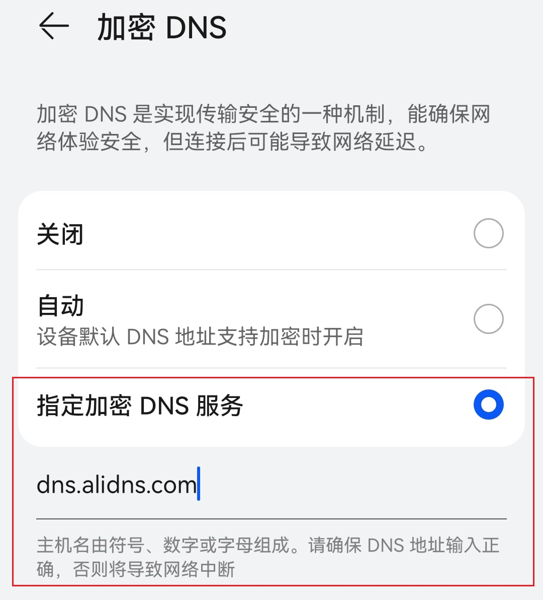
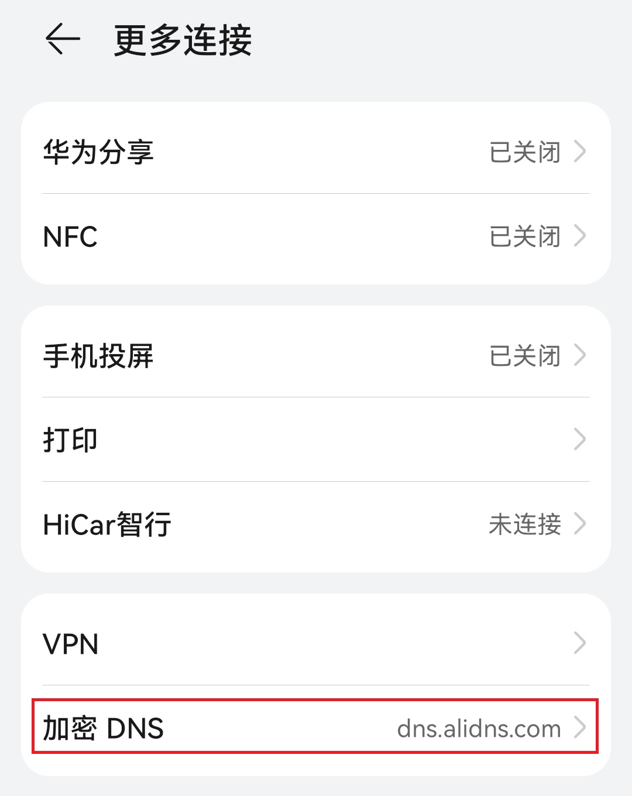

**示例**  
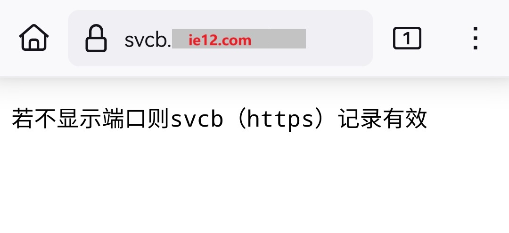

---

参考：  
* https://blog.xavierskip.com/2023-07-06-dns-svcb-https/
* https://66666.host/dns-https-hide-port/
* https://blog.kaciras.com/article/42/speedup-your-site-with-http3-using-nginx-and-dns-svcb
* https://tao.zz.ac/dns/dns-svcb-https.html
* https://r2wind.cn/articles/20221111.html
* https://hostloc.com/thread-1139573-1-1.html
* https://blog.nkxingxh.top/archives/293/
* https://docs.dnspod.cn/dns/help-redirect-url/
* https://developer.mozilla.org/zh-CN/docs/Web/HTML/Reference/Elements/iframe
* https://wzh.me/Technology/Network/DNS-HTTPS-Record/
* https://support.dnspod.cn/dns/help-svcb/
* https://serverfault.com/questions/1151933/how-does-a-web-browser-use-a-https-or-svcb-dns-resource-record-rr

