# 「LUCKY STUN穿透」使用UptimeRobot使UPnP映射的TCP规则保持活跃


在之前的教程中我们通过UPnP映射 webhook等功能配合STUN穿透  
**实现了在无IPv4公网环境下全自动的为BT客户端开放端口**  

* [LUCKY STUN穿透在Windows上使用UPnP工具为BT客户端自动添加内外端口号不同的映射规则](./stun穿透-bt.md)
* [「LUCKY STUN穿透」在Docker中使用MiniUPnP为BT客户端自动添加内外端口不同的映射规则](./stun-docker-upnp.md)
* [「LUCKY STUN穿透」使用 Webhook 自动修改 qbittorrent 的监听端口](./stun-qb端口自动化.md)
* [「LUCKY STUN穿透」使用 cURL 自动修改 Transmission 的监听端口](./stun-tr修改端口.md)

---

但有一些网友反映UPnP映射规则会在一段时间后自己消失  
与此同时STUN穿透并没有变化  

这应该是由于 **映射规则不活跃导致的** 即路由设备会认为这个规则是陈旧的需要清理  
当然不同的设备表现不一样 清理的时间应该也是不一样的  
**一般认为在规则租约期为无限的情况下 只要有流量通过规则其应该就不会被清理**  

这其实对BT来说不是什么问题  因为几乎一直会有流量和连接  
但是对PT（主要看保的种子）和其他 **不总是有流量的服务** 来说就是另外一回事了  

当然在我们之前教程中所设置的映射规则租约是无限的  
**所以我们只需要解决流量问题**  

我们可以使用 **UptimeRobot** 这个网站来解决问题  
其本身用于网站检测 即检测网站或其他服务是否运行正常  
**我们需要使用它的端口检测功能**  

---

## 注册 UptimeRobot

访问：`https://uptimerobot.com/`

**注册账户**  


**填写信息**  
只需填写前三项 分别为 昵称 邮箱 和 密码  


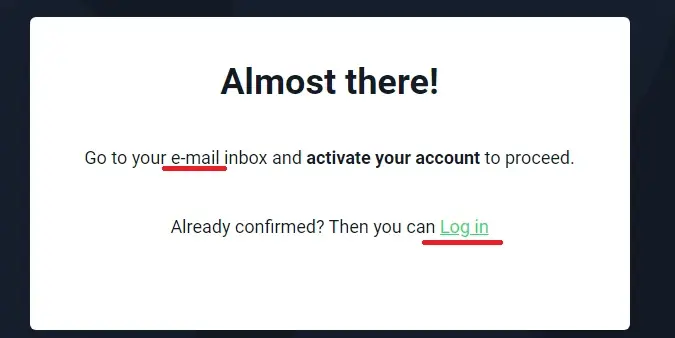

**通过邮件激活账户**  

点击激活邮件中的链接以激活账户  
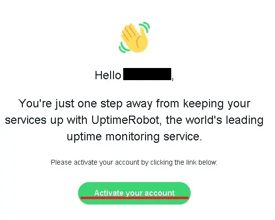

---

## 配置监视器

**登录账户**  

首次使用会弹出设置向导  
**我们使用向导进行设置** 之后会介绍不使用向导的设置方法  


**创建监视器**  
点击右侧的箭头弹出菜单 选择 **Port monitoring**  
**IP or host** 这里填写一个已经解析到BT客户端所在设备IP的（动态）域名  

如果还没有设置过可以看看之前的教程或者其他（动态）域名教程 [链接](./lucky-ddns-2.15)   
端口号填写 **BT客户端正在监听的端口填写** 完成后点击创建  


**测试通知**  

其作用是监视的网站或端口离线后发出警告  
这里我们用不到这个功能 **直接跳过**  


**设置状态页面**  

其为一个公开的网页可以用来显示多个监视器的状态  
这里我们用不到这个功能 **直接跳过**  


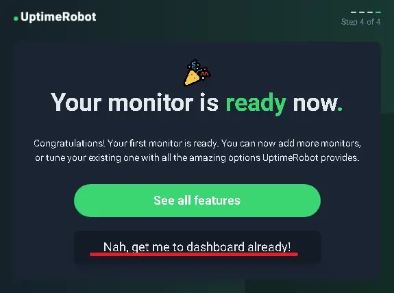


**不使用向导设置监视器**  
与使用向导设置的方法基本相同  


选择监控类型 填写IP和端口 **建议取消勾选下面的邮件提醒**  
免费版扫描间隔最小为5分钟  

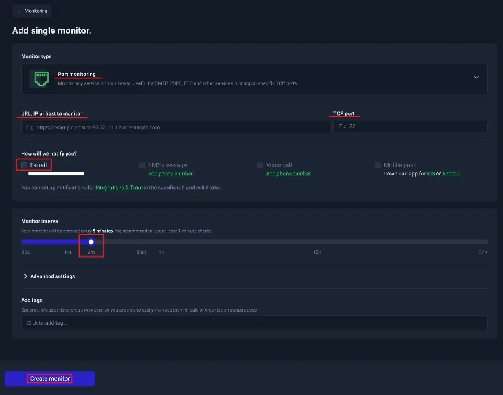

---

## 设置更新API

通过上述的设置 现在网站会每隔5分钟探测一次我们BT客户端的端口  
尽管5分钟的间隔有点长 端口扫描所产生的流量也很小  
**但这足够让UPnP映射规则保持活跃了**  

不过由于我们使用STUN进行穿透 所以端口是动态的  
需要在端口变化后更新监视器中的端口  

之所以选择UptimeRobot是因为其提供的更新AP可以使我们可以轻松的更新监视器端口  
API文档：`https://uptimerobot.com/api/`  


### 获取更新KEY

目前UptimeRobot 似乎正在更新界面  
我们刚才所看到的都是新界面  

像更新API设置这样的高级功能似乎还没有迁移过来  
我们需要回到它的 **旧版页面** 点击上方横幅中的 **old app**  


回到旧版界面后  
点击右上角的用户名 弹出 菜单 选择 **My Settings**  


滚动页面到底部可以看到 **API Settings**  
点击 创建主更新key  


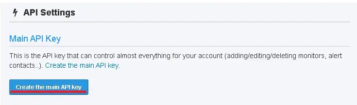
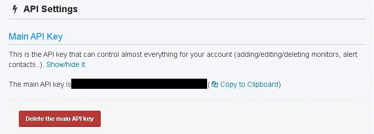


### 获取监视器ID

有了更新key后我们还需要获取监视器ID  
请求方法：`https://uptimerobot.com/api/#getMonitorsWrap`  
这里使用lucky计划任务中的callweb功能进行获取  

### 创建计划任务


任务备注 、执行周期、执行时间等任意填写
子规则选择 **callweb** 并填写下列内容

接口地址：`https://api.uptimerobot.com/v2/getMonitors`
请求方法： POST

请求头：  
```
Content-Type: application/x-www-form-urlencoded
Cache-Control: no-cache
```

请求主体：  
```
api_key=你的API_Key&format=json&logs=1
```

禁用callweb调用成功字符串检测：**是**  

**保存任务**  


**示例**  


关闭规则开关 我们只使用 **手动触发**  

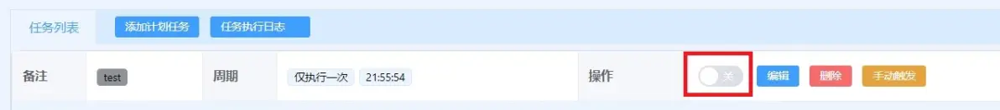

按下手动触发按钮并查看日志 应该可以看到 `stat:ok`  
在monitors 和 friendly_name 之间的ID就是我们需要的 **监视器ID**  


### 更新端口号

在获取了监视器ID后我们就可以开始 **更新端口号了**  
依然是先在计划任务中测试 完成后再填写到STUN规则中  

请求方法： `https://uptimerobot.com/api/#editMonitorWrap`  

考虑到经过之前教程中的一系列设置STUN穿透规则中的webhook可能已经被占用
所以这里给出 使用 webhook 和 curl配置的两种方法 **测试阶段端口号可任意填写**  
curl在不同平台上的安装方法可以看之前的教程：[链接](./stun-tr修改端口.md)   


### Curl配置方法

Linux平台(Docker)  

```
curl -X POST -H "Cache-Control: no-cache" -H "Content-Type: application/x-www-form-urlencoded" -d "api_key=你的APIKey&format=json&id=监视器ID&port=新端口号" "https://api.uptimerobot.com/v2/editMonitor"
```

**示例**  

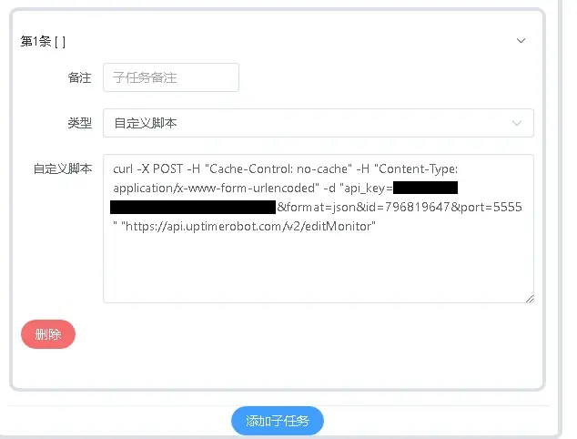

**Windows平台**  

Windows下要额外添加 `--ssl-no-revoke` 参数不然会出现无法检查证书是否吊销的 **报错**  
这可能是Windows下的检查方式和Linux下不太一样导致的  详见：[链接](https://blog.csdn.net/Dancen/article/details/109730392)


```
curl --ssl-no-revoke -X POST -H "Cache-Control: no-cache" -H "Content-Type: application/x-www-form-urlencoded" -d "api_key=你的APIKey&format=json&id=监视器ID&port=新端口号" "https://api.uptimerobot.com/v2/editMonitor"
```


按下手动触发按钮 检查输出日志  
成功会返回`ok`和 **监视器ID**  

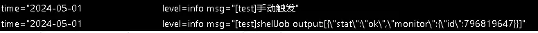

### Webhook配置方法

请求地址：  
```
Content-Type: application/x-www-form-urlencoded
Cache-Control: no-cache
```
请求主体：  
```
api_key=你的APIKey&format=json&id=监视器ID&port=新端口号
```

禁用callweb调用成功字符串检测：**是**  


**示例**  
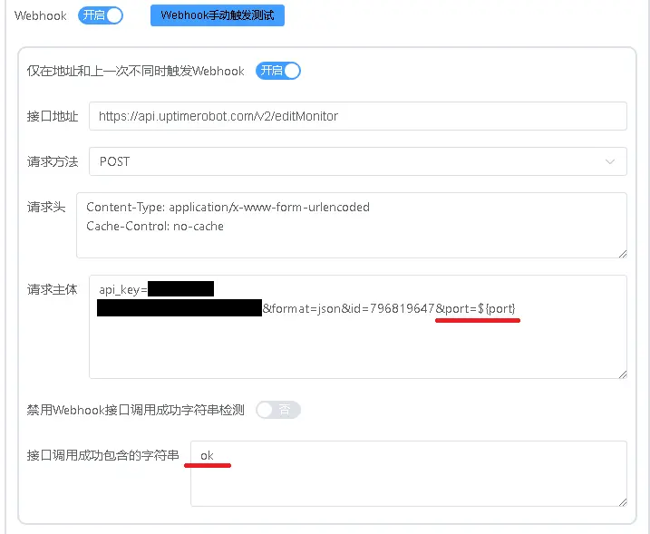

按下手动触发按钮 检查输出日志  
成功会返回`ok`和 **监视器ID**  


---

## 编辑STUN穿透规则

### 使用Curl

将之前测试完成的脚本 复制到STUN的自定义脚本区域  
若在自定义脚本区域 **已经有命令** 则应按照流程顺序进行排列并**设置间隔**  

Linux下可以使用 **sleep命令** 实现而在Windows下需要使用 **vbs脚本** 实现类似效果  
可以查看之前的教程：[链接](./stun穿透-bt.md)   

还需将 port 的值替换为 STUN穿透 端口变量  
`api_key=你的APIKey&format=json&id=监视器ID&port=${port}`


**示例**

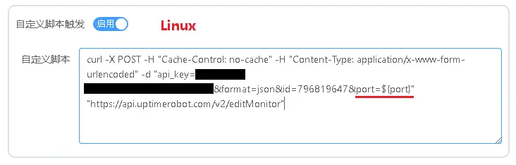


### 使用Webhook

与在计划任务中测试的时候基本相同  
要把 port 的值替换为 STUN穿透 端口变量  
`api_key=你的APIKey&format=json&id=监视器ID&port=${port}`  

同时将 禁用Webhook接口调用成功字符串检测 改为 **否**  
并填写 ok 作为判断执行成功的字符串  


**示例**  

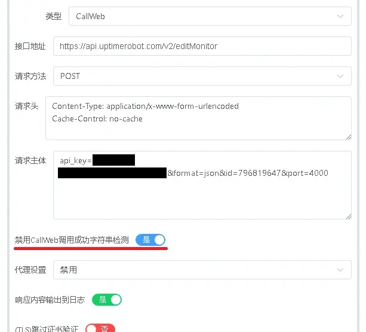


填写完成后可以按下右上角的 **手动触发测试**  
手动测试会使用固定的参数比如端口号固定为 `6666`  
返回ok和监视器ID即表示更新成功  

**至此我们便完成了UPnP映射规则的保活设置**  

