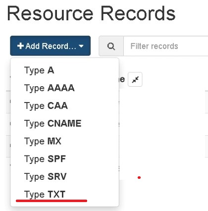
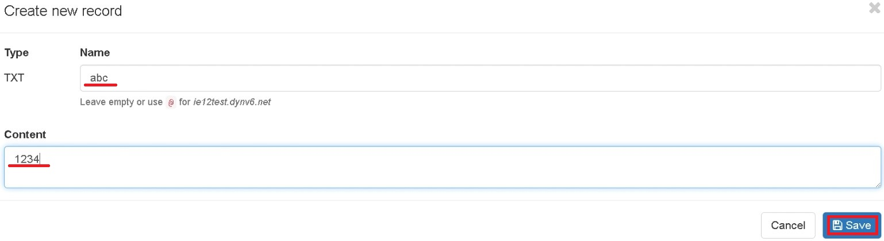
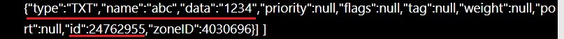
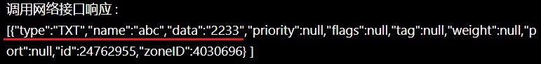
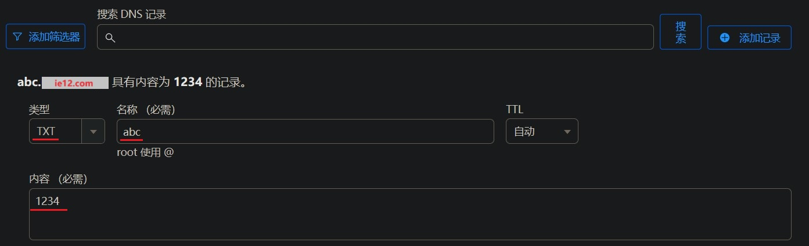
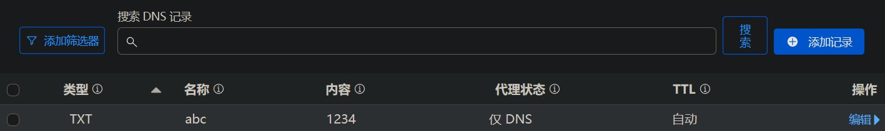
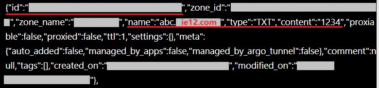
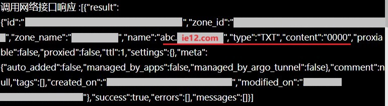

# 「前置」在Dynv6和Cloudflare上更新TXT记录

2024.10.03  

---

文中更新TXT记录的方法已经过时 **lucky在2.15版本后已经支持TXT记录**  
**这使得配置方法极大简化 请移步至此教程： [链接](./lucky-ddns-2.15.md)**

---

## 关于本教程

本教程为前置教程 旨在提前讲解和说明  
未来的一个或多个教程中可能会重复提及的内容  

本教程将介绍 如何通过wehhook更新  
设置在Dynv6和Cloudflare上更新TXT记录  
Cloudflare 下文简称 CF  

---

## 在Dynv6上更新TXT记录

与之前介绍的更新SRV记录的方法相似  
先创建一个TXT记录 获取更新令牌 区域ID和DNS记录ID  
最后进行更新  

在Dynv6上更新SRV记录的教程：[链接](./stun-mc-srv.md)  
请先阅读完之前的教程后再继续阅读之后的内容  

### 创建 TXT 记录

相比起之前的SRV记录设置起来会更简单  
只需要填写**名称**和**内容**两项即可  
其按照实际情况进行填写 这里使用 "test"和"1234"  






### 获取 更新Token

要通过API更新DNS记录我们需要先获取  
用于身份验证的Token  
详情请查看之前的教程：[链接](./stun-mc-srv.md)  


### 获取 区域ID

在获取完令牌后就可以开始获取区域ID了  
详情请查看之前的教程：[链接](./stun-mc-srv.md)  


### 获取 DNS记录ID

在获取了区域ID后就可以获取DNS记录ID  
也就是我们之前创建的TXT记录的ID  
详情请查看之前的教程：[链接](./stun-mc-srv.md)  





### 更新 TXT 记录

获取完区域ID和DNS记录ID后就可以更新TXT记录了  
部分参考之前的SRV记录更新方法：[链接](./stun-mc-srv.md)  
**主要的区别是请求主体的写法**  

name为记录名称 data为记录的内容  

```
{
"name": "abc",
"data": "2233"
}
```

**更新效果**  




---

## 在Cloudflare上更新TXT记录

与之前介绍的更新SRV记录的方法相似  
先创建一个TXT记录 获取更新令牌 区域ID和DNS记录ID  
最后进行更新  

在Cloudflare上更新SRV记录的教程：[链接](./cf-srv设置.md)  
请先阅读完之前的教程后再继续阅读之后的内容  


### 创建 TXT 记录

相比起之前的SRV记录设置起来会更简单  
只需要填写**名称**和**内容**两项即可  
其按照实际情况进行填写 这里使用 "abc"和"1234"  

假想主域名为 `ie12.com`





### 获取 更新Token

要通过API更新DNS记录我们需要先获取  
用于身份验证的Token  
详情请查看之前的教程：[链接](./cf-srv设置.md)  


### 获取 区域ID

在获取完令牌后就可以开始获取区域ID了  
详情请查看之前的教程：[链接](./cf-srv设置.md)  


### 获取 DNS记录ID

在获取了区域ID后就可以获取DNS记录ID  
也就是我们之前创建的TXT记录的ID  
详情请查看之前的教程：[链接](./cf-srv设置.md)  



### 更新 TXT 记录

获取完区域ID和DNS记录ID后就可以更新TXT记录了  
部分参考之前的SRV记录更新方法：[链接](./cf-srv设置.md)  
**主要的区别是请求主体的写法**  

tpye为记录类型 填写TXT content为记录的内容  

```
{
"type": "TXT",
"content": "3721"
}
```

**更新效果**  




---

## 结尾

至此我们就实现了 使用wehhook更新  
设置在Dynv6和Cloudflare上更新TXT记录  

