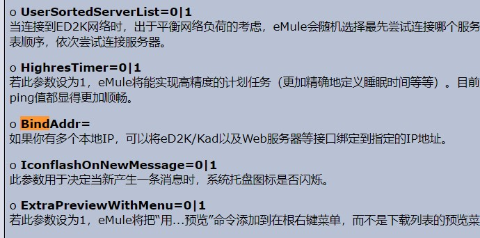
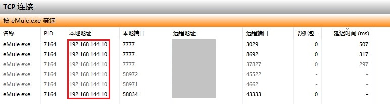
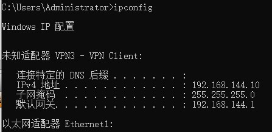

# eMule设置IP绑定 

eMule在图形界面中无法设置IP绑定  
但可以通过修改preferences.ini配置文件实现  
此选项可以让eMule从指定的本地IP发起连接 这对UDP和TCP均有效  

该选项为使用VPN让eMule获得highID 且不影响正常上网的方案提供了可能性  
通过指定本地发起IP外加调整VPN网关的跃点数以实现正常上网和eMule流量的分离  

**设置方法：**  
在 preferences.ini 的 `[emule]` 区段（节）中  
添加 `BindAddr=` 字段 后面加上需要绑定本地IP地址  

值得注意的是这个字段的添加位置 **（编码必须选择 ANSI）**  
不能随意的将其插入到节中 从帮助文件列出的字段顺序来看  
其应在 `HighresTimer`字段的下面 就像eMule帮助页面中列出的那样  

**配置示例**  

**检视效果**  

---

参考：  
eMule官方帮助：[英文](https://www.emule-project.com/home/perl/help.cgi?l=1&topic_id=121&rm=show_topic) | [中文](https://www.emule-project.com/home/perl/help.cgi?l=42&topic_id=1607&rm=show_topic)  
eMule Fans 转载的帮助信息（中文）：[链接](https://www.emulefans.com/preferences-ini/)  

