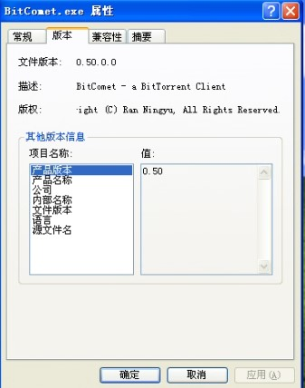
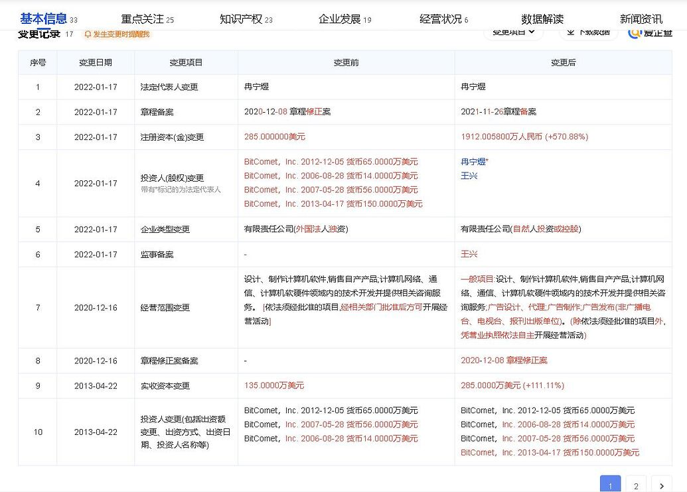
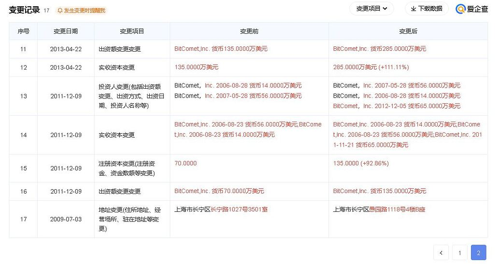
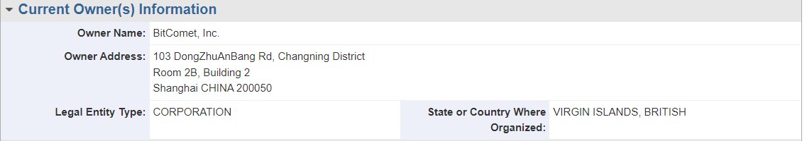
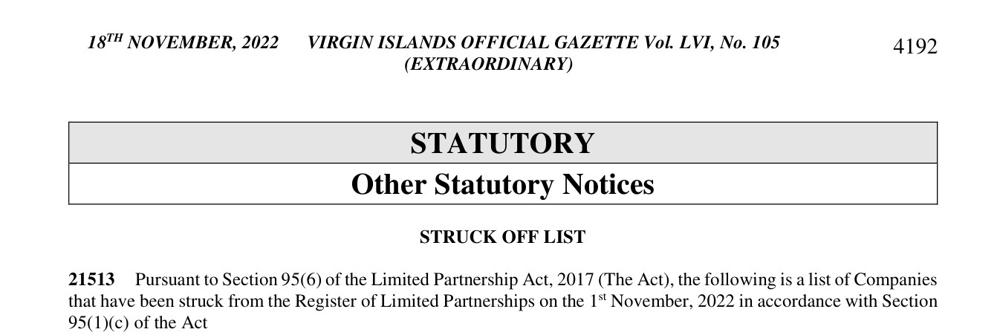
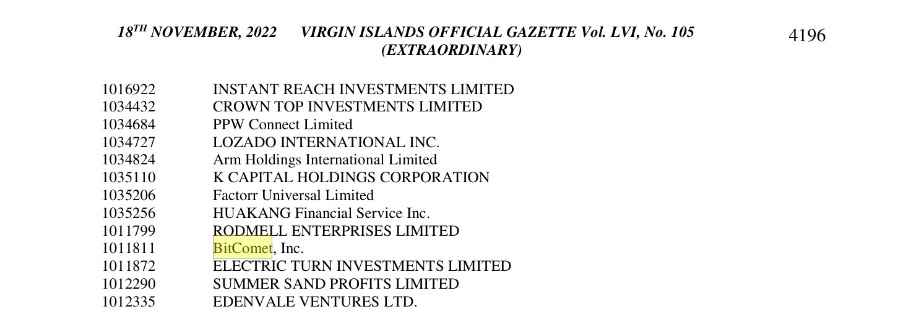

# 有关比特彗星的奇谈怪论

本文是 [有关比特彗星若干历史遗留问题的整理](./BC历史遗留问题.md) 的续  
原文链接：[链接](https://www.cometbbs.com/t/95248/9)  


我还注意到一些奇怪的观点即 “比特彗星是外国人的软件”  
* [链接1](https://bbs.itzmx.com/thread-107240-1-1.html) 
* [链接2](https://bbs.itzmx.com/forum.php?mod=viewthread&tid=110259)  

其根据为比特彗星英文论坛的用户列表  
以及比特彗星的UPNP工具在卡巴斯基网络中的地区分布统计  

我不知道为什么要选择UPNP工具的地区分别分布情况  
而不选择主程序的分别情况  

而使用英文论坛用户和开发者来证明开发者和受众都是外国人  
就像是在火车上采访乘客们有没有买到票一样  

**以及其认为BC是由一位名为 RnySmile 的“美国人”开发的**  
然而这个RnySmile不是别人他其实就是 **冉宁煜** 就像大部分资料中说的那样  

要验证这个其实很简单 在官网上下载0.5旧版即可:[链接](https://www.bitcomet.com/tw/archive)  
在其中的 ReadMe_Chinese.txt 可以看到  

```
版权
==============
版权所有 @ 2003-2204 灿烂微笑(~RnySmile~) <bitcomet@yahoo.com>
非商用免费软件。具体请看license.txt
```
（原文如此确实是2204年 不过网页上写的是2004）  

要是觉得下载文件太麻烦 也可以直接看网页  
* [链接1](https://web.archive.org/web/20041230031645/http://bitcomet.com/index-zh.htm)
* [链接2](https://web.archive.org/web/20050113044622/http://www.bitcomet.com/doc/license-zh.htm)

当然这只能说明RnySmile和灿烂微笑是同一个人  
但其实只需要看一下主程序的属性-版本/详细信息 就明白了  
```
Copyright (C) Ran Ningyu, All Rights Reserved.
```

这个 Ran Ningyu 就是冉宁煜 而RnySmile 前面的Rny 其实就是  
取的 冉宁煜 的首字母  



至于比特彗星早期的故事其实看这篇报道即可：[独家专访BitComet：无间道行走 快乐并BT着](https://web.archive.org/web/20060424005426/http://www.pconline.com.cn/news/yj/0604/784835.html)  

其中说的很清楚 三位创始人：冉宁煜、黄希威、王兴  
目前已知的三位创始人所使用的代号  
* 冉宁煜：RnySmile、灿烂微笑
* 黄希威：易龙一号
* 王兴：wxhere

除此之外还找到了2010年《南方人物周刊》对时任迅雷CEO邹胜龙的采访:[链接](https://kb.cnblogs.com/page/79581/)  

>  当极客无法升级为团队，胜负立判。邹胜龙问过同行、Bitcomet创始人冉宁煜，你怎么一年里都不更新，你干嘛呢？
>  
>  冉很尴尬回答，我挺郁闷的，这软件一开始是我一个人写的，很多地方没那么讲究，组建公司后发现不重新编码，程序员没法跟进，我只好带着大家重写了一遍。

尽管在报道中添加和迅雷和其他同行的对比 大概是为了凸显  
“迅雷更加的高明” 但此段文本可以证明BC的作者就是冉宁煜  

---

不过来自爱企查的企业变更信息 却似乎显示了一些不同的内容：[链接](https://aiqicha.baidu.com/company_detail_32340882805849)  




2022-01-17公司类型从 外国法人独资变为自然人投资或控股  
与此同时 BitComet，Inc. 退出  
看起来在此之前BC的国内公司似乎都是由BitComet,Inc.这个外国公司所控制的  

**但其实这个BitComet,Inc.其实只是注册在外国**  
**其登记地址依然在国内** 这在之前 [有关比特彗星若干历史遗留问题的整理](./BC历史遗留问题.md) 中  
所找到的商标注册信息已经给出了线索  



公司注册在英属维尔京群岛  
但登记地址是在上海 长宁区 东诸安浜路103号 其似乎是一个小区  

其与BC国内公司的注册地同在 上海市长宁区  
我猜测其所有者也是冉宁煜  

本想查询BitComet,Inc. 以获得更多信息  
但其注册地英属维尔京群岛 和开曼群岛类似  
是个注册公司条件宽松 信息保密程度高的地方  

要查询在维尔京群岛注册的公司需要填报申请并支付费用  
也难怪公开的信息这么少 [注册机构页面](https://www.bvifsc.vg/company-searches)  

不过还是找到了一些线索 但有关BitComet,Inc.的具体信息我们也许永远也不会知道了  
因为其已经被其注册机构除名了 [注册机构公报](https://eservices.gov.vg/gazette/sites/eservices.gov.vg.gazette/files/governmentandstatutorynotices/%23105%2018th%20November%2C%202022%20EXTRA.pdf)  
PDF文件存档：[链接](../../图片/有关BC的奇谈怪论/英属于维吉尔群岛注册机构公报.pdf)  

> 被除名名单
> 21513 根据《2017 年有限合伙法》（该法）第 95(6) 条，以下是已根据该法第
> 95(1)(c) 条于 2022 年 11 月 1 日从有限合伙登记册中除名的公司名单




---

除此之外还在一份2012年的招股书中找到了有关BitComet,Inc.的一些蛛丝马迹：[链接](http://vip.stock.finance.sina.com.cn/corp/view/vISSUE_RaiseExplanationDetail.php?stockid=300323&id=911418&qq-pf-to=pcqq.group)  


> 俞信华先生，1974 年出生，中国国籍，无境外永久居留权，浙江大学材料
> 学专业学士，长江商学院 MBA，现任本公司监事。俞信华先生曾任上海西门子
> 移动通信有限公司市场部经理，西门子中国有限责任公司市场部经理，2005 年
> 10 月至今担任 IDG 资本投资顾问（北京）有限公司副总裁；2008 年 1 月起担
> 任本公司监事。**俞信华先生目前同时担任 Bitcomet Inc. 董事**、北京昆兰新能源
> 技术有限公司董事、云南蓝晶科技股份有限公司监事等职务。

也许Bitcomet,Inc.的注册人其实是这位俞信华先生  


