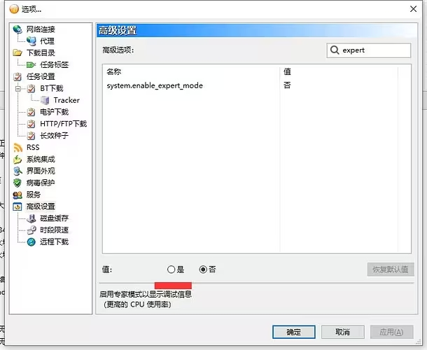
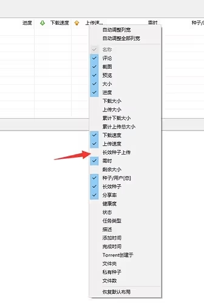
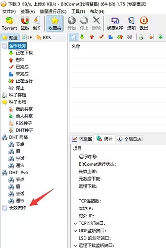
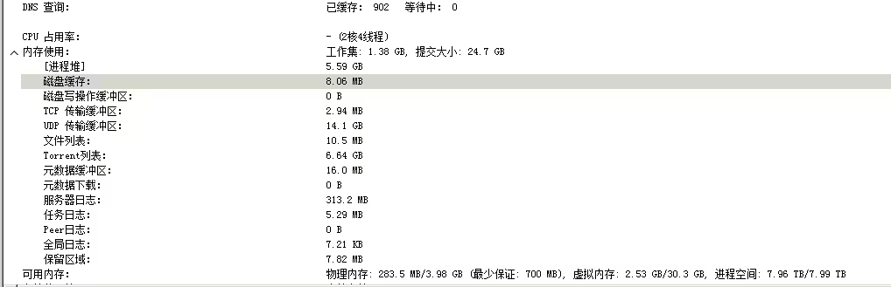
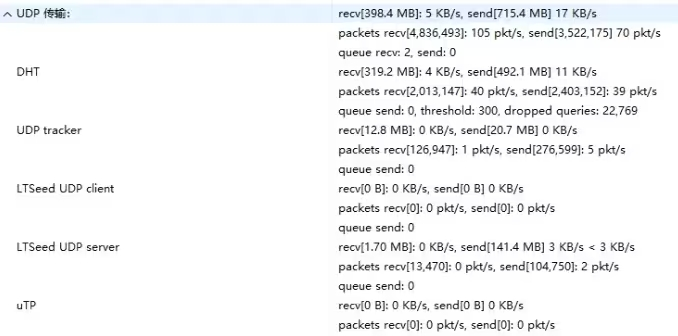

# 比特彗星常见问题-专家模式及其作用

2023.09.11  

**问：** 如何开启专家模式？  

**答：** 高级设置中 搜索 `system.enable_expert_mode` 选择**是**  
并应用 即可开启专家模式  

**问：** 开启专家模式有有什么用？  

**答：** 开启专家模式后可以显示更多信息以方便诊断  

**问：** 有哪些较为常用的调试信息？  

**答：** 常见的调试信息如下  

## 长效做种信息

此时任务栏上点击 **右键** 即可打开”长效种子上传“标签  
或者左侧点击长效做种，也可以看到 **完整的列表**  
可用于观察哪个（些）任务在进行长效上传  

---

## 详细内存占用

可以查看内存占用的细节，用于内存占用过高时的诊断  

---

## UDP传输量

一般用于确定网络发生断流时哪一项发送了过多的UDP包  

---

参考和引用:

* [cometbbs-启用专家模式](https://www.cometbbs.com/t/54910)
* [cometbbs-吃这么多内存](https://www.cometbbs.com/t/86276)

