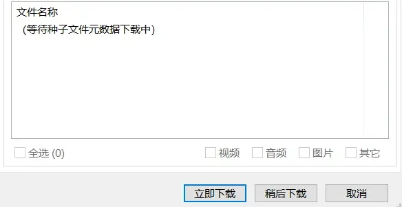
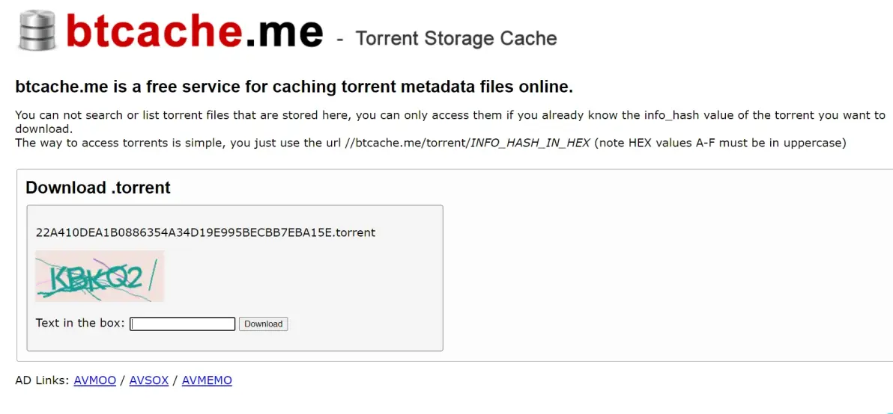
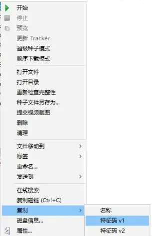

# 比特彗星常见问题-元数据获取问题

2023.10.29  

**问：** 添加任务后一直显示 等待元数据文件下载中  

**答：** 点  立即下载 即可，获取元数据需要一些时间，获取后会开始下载  

**问：** 部分任务获取到了，但是还有一些任务 还是不行  

**答：** 可以尝试重启任务 即暂停任务后再开始 BC下载元数据时似乎不支持断点续传  
即必须从一个用户那里完整的获取到元数据，不能从多个用户获得一部分后再拼接起来  
重启任务可以加快重试 **应该可以提高下载元数据的成功率**  

**问：** 重启过任务后又有一些获取成功了，不过还是有获取不到的  

**答：** 可以尝试通过在线工具来获取种子  

BTSOW：https://btsow.bond/convert/magnet  
在btsow用磁力转换成种子是比较方便的  
将磁力复制到剪贴板后直接粘贴即可  

获取成功后会来到详情页面  

点击中间的按钮下载 种子文件  
会跳转到 btcache.me   

输入验证码后即可进行下载  
缺点是 btsow的网址会频繁更换 可能需要代理才能访问  
网址发布页：https://tellme.pw/btsow  

**问：** btsow似乎是通过调用 btcache.me  
来进行种子获取的，为什么不直接使用 btcache.me来下载种子？  

**答：** 对 因为在btsow可以直接使用磁力  
而直接在btcache.me下载只能使用特征码并且有格式要求  
（相当于btsow在调用btcache.me时对输入的磁力进行了一次转换）  

其只能使用16进制哈希即特征码 并且全部字母要大写（使用URL链接下载时必须全部大写）  

**问：** 那如何直接在`btcache.me`下载种子？  

**答：** 先在BC中选择无法获取元数据的任务，右键弹出菜单 选择复制> 特征码v1  

粘贴特征码并点击下载  

若获取成功会和之前一样跳转到下载界面  
也可以去 https://itorrents.org/ 看看  
其不需要填写验证码 但下载起来稍微复杂一些  

**问：** 这些网站都在国外访问起来比较麻烦 有没有使用软件获取的方法？  

**答：** 有 可以使用其他的客户端进行来获取 完成后再由BC下载，比如迅雷  

**问：** 迅雷？迅雷不是吸血客户端吗？  

**答：** 是的 可能除了迅雷极速版和远古版本的迅雷外 相对较新的版本都是吸血的  
不过这里我们要利用迅雷来获取元数据 **确切的来说是利用迅雷的服务器来下载元数据**  
具体的操作已经有人做过教程了  

---

此部分 来自 像素帝的教程 ： ~~https://www.cometbbs.com/t/83650~~  
如果看不清楚可以 右键图片选择在新标签页打开图片  

---

**问：** 如果用了这么多方法还是没办法获取要怎么办？  

**答：** 如果尝试了上述所有的方法还是无法获取元数据的话 建议更换种子  
这个可能已经是个死种了  
当然也可以一直挂着 过上几个月说不定就获取到了  

---

参考和引用：  
* https://www.cometbbs.com/t/77253
* https://www.cometbbs.com/t/54662
* https://www.cometbbs.com/t/79641/99
* https://www.cometbbs.com/t/84501/2
