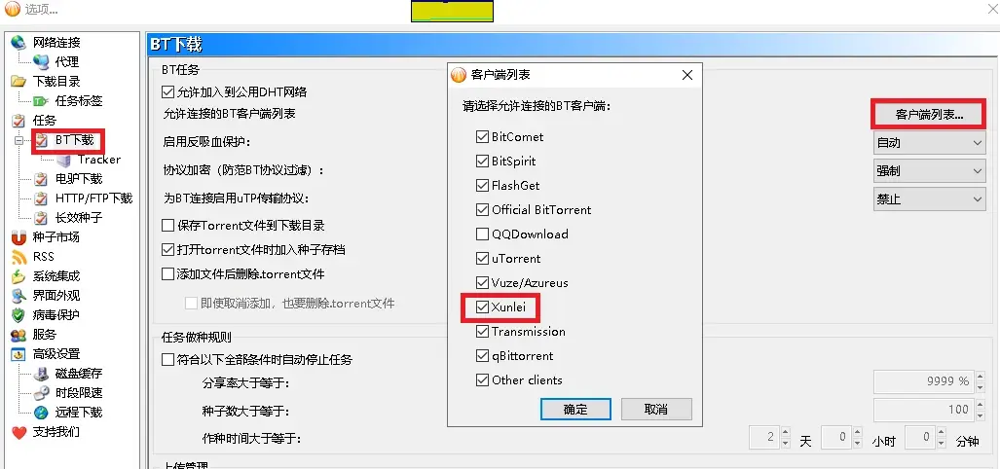
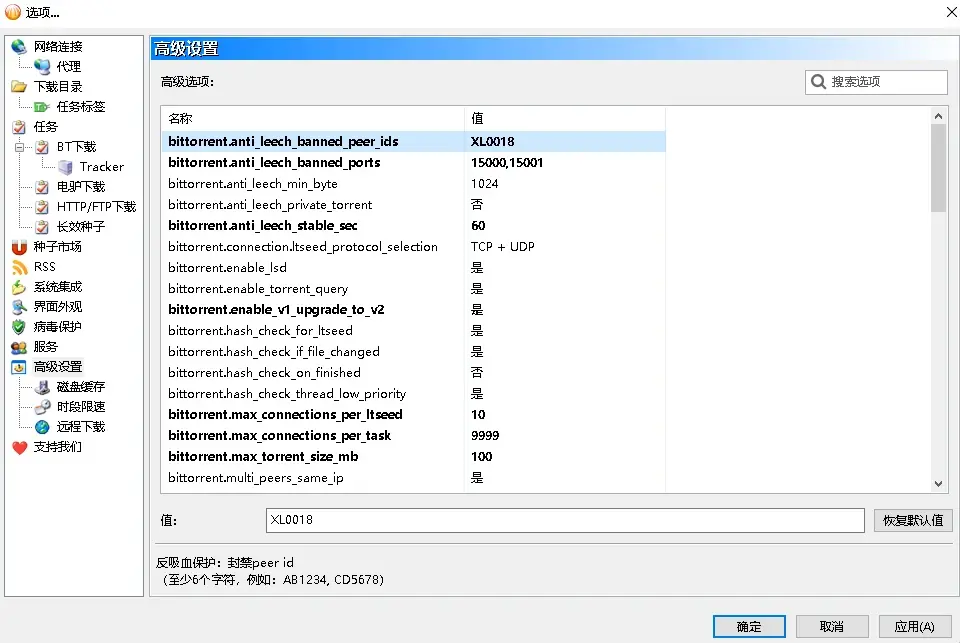
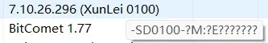
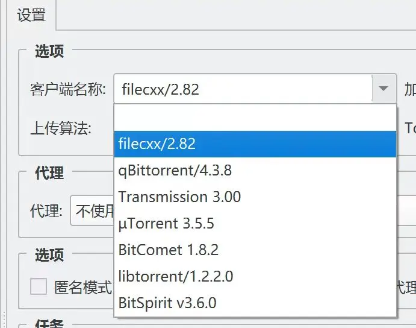
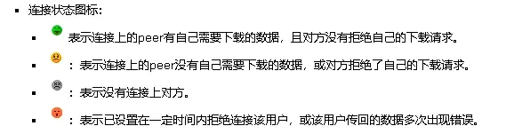

# 比特彗星常见问题-屏蔽吸血客户端和设置自动反吸血

**问：** 如何屏蔽迅雷等吸血客户端？  

**答：** 设置》BT下载》客户端列表 中取消勾选迅雷  
不过这可能会有误伤  

**问：** 误伤？  

**答：** 对 并不是所有迅雷都是吸血的  

从经验来看：  

* **使用 15000 或 15001 端口的迅雷是吸血客户端**  
 **客户端ID 显示为 XL0018 的迅雷是吸血客户端**  
 **没有汇报进度即进度始终为 0 的迅雷是吸血客户端**  

* 客户端ID 显示为 XL0012 **使用 15000 或 15001 端口**  
**且没有汇报进度的迅雷是吸血客户端**  

* 客户端ID 显示为 XL0012 **但不使用 15000 或 15001 端口**  
**有汇报进度的迅雷不是吸血客户端**  

* 客户端ID显示为XL0100实际ID**以SD开头而不是一般的XL**  
 不使用 15000 或 15001 端口 且 有下载进度汇报的迅雷  
 **其为迅雷极速版 不是吸血客户端**  

**问：** 那该如何屏蔽这些吸血客户端，同时防止误伤呢？  

**答：** 在高级设置中 屏蔽 ID XL0018 以及15000 和 15001 端口  

**效果：**  

**问：** 如果还有其他的吸血客户端 该如何进行屏蔽呢？  

**答：** 手动添加ID 需要填写实际ID  
将鼠标放在 **客户端名** 上 可查看实际客户端ID  

不同的版本客户端对应的ID号也不一样  
**需要至少6字符才能匹配**  

---

**2.08版本之后**

BC在2.08版本支持了 **客户端名称屏蔽** 可直接使用客户端名称来进行屏蔽  
与客户端ID屏蔽类似  也需要至少6字符才能匹配  
相比起ID其可以更方便的屏蔽某个系列的客户端  

**示例**  

每个客户端名称之间使用 **英文逗号** 分开   
端口号和ID屏蔽也是如此  

**效果**  

**问：** 这样可以百分百屏蔽吸血客户端吗？

**答：** 其实不能，因为客户端ID是可以伪装的

**问：** 伪装？也就是可以使用任意的名字做客户端ID?

**答：** 是的 毕竟你看到的客户端ID是对方汇报的 可以伪装  
一些客户端中可以直接设置客户端ID  

常见被用于伪装的正常客户端名：  

* **libtorrent**
* **transmission**

**问：** 那该怎么办？  

**答：** 更好的方法是使用 **基于上传量的自动反吸血**  
**即设置》bt下载 中的反吸血保护设置**  

其根据对方的上传量来判断是否吸血  
比特彗星中文维基中的解释：[链接](http://http://wiki-zh.bitcomet.com/bitcomet%E5%85%A8%E5%B1%80%E9%80%89%E9%A1%B9?s%5B%5D=%E5%90%B8%E8%A1%80)  

>启用反吸血保护：默认为自动，启用反吸血保护，就会拒绝吸血BT客户端的连接，从而提高下载速度。  
>  
> * 禁止：禁止使用反吸血保护功能。
> * 自动：对于所有连接都按照“高级选项”中的反吸血条件，判断是否拒绝连接。
> * 严格：直接拒绝某些吸血客户端的连接；其他客户端则按照”高级选项”中的反吸血条件，判断是否拒绝连接。

**高级设置中的反吸血选项：**  

> * bittorrent.anti_leech_min_byte  
> 设定反吸血保护流量：要求对方在指定时间（秒）内需要上传的最少流量（byte）， 取值范围：1-10000。  
>  
> * bittorrent.anti_leech_min_stable_sec  
> 设定反吸血保护时间：指定与对方连接多长时间（秒）后开始检查流量（byte），取值范围：1-10000。  

反吸血选项 **建议设置为自动**  
高级设置中的选项**保持默认即可**  

**客户端列表中连接状态的含义：**  
~~截图自比特彗星中文维基（官方维基年久失修图片无法显示 此为网页时光机记录的内容）~~  

* **绿脸：** 已经连接 给你上传 （从这个这个用户获得了下载速度）  
* **黄脸：** 已经连接 但没有给你上传（没有从这个用户获得下载速度 做种时所有的连接上的用户均为黄脸 因为无需也无法为你提供速度）  
* **灰脸：** 没有连接上  
* **橙脸：** 已被封禁(如果双方都下载完成也会 通过封禁的方式断开 防止短时间内重复连接)  

**问：** 反吸血设置是越严越好吗？  

**答：** 也不是，设置过于严格 **有可能会造成误伤**  

**问：** 使用上传量进行判断也会有误伤？  

**答：** 是的 **如果反吸血保护流量设置较大或者反吸血保护检查时间设置的很短**  
**有可能会将上传速度慢的客户端判断为吸血客户端**  

**问：**上传这么慢 难道不是吸血吗？  

**答：**
吸血行为一般指的是用户下载文件的一小部分 并且**不对这部分进行上传**  
**从而不与其他用户共享下载完成的部分**  
如果一个用户在下载过程的上传速度较慢 但**仍然持续上传一部分数据**  
**那么这通常不会被视为吸血**  

**简而言之 上传的慢不是吸血 一点上传都没有才是吸血**

**问：** 做种的时候别人不会给我上传 这时候反吸血还有效吗？  

**答： 做种状态基于上传量识别反的吸血不会启用** 此时反吸血仅有客户端ID过滤和端口过滤起效  

**问：** 这么来如果在做种时遇到会伪装的吸血客户端就没办法自动识别了吗？

**答：** 是的 不过已经可以屏蔽绝大多数的吸血客户端了 剩下的大概是网盘的离线服务器

**问：** 网盘的离线服务器？

**答：** 很多网盘有所谓的离线下载功能其实就是 **让服务器去帮你下载**  
这些离线服务器下载的时候 **大概也是没有上传的**  
而且伪装能力较好 伪装客户ID的同时 似乎也会伪装下载进度  

**问：** 那岂不是无法屏蔽这些离线服务器了？  

**答：** 是的 除非依靠IP屏蔽 否则没有太好的解决方法  
而且彗星也不支持IP过滤  

不过也有人认为 离线服务器吸血不一定是坏事  
离线服务下载完成一份资源后就会缓存在云端  
**不会再进行下载 在一定程度上提高了资源的存活率**  

---

参考和引用：  
* https://post.smzdm.com/p/awxqq6xg/
* https://www.cometbbs.com/t/43879
* https://www.cometbbs.com/t/87634/2
* https://www.cometbbs.com/t/47445
* https://www.cometbbs.com/t/44396/9
* https://www.cometbbs.com/t/83736
* https://www.cometbbs.com/t/87634
* https://www.cometbbs.com/t/69780/3
* https://www.cometbbs.com/t/75967/16
* https://www.emulefans.com/leech-leecher-behavior/
* https://www.emulefans.com/leecher-dlp/
* https://github.com/c0re100/qBittorrent-Enhanced-Edition/issues/190

