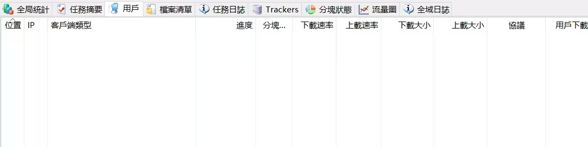
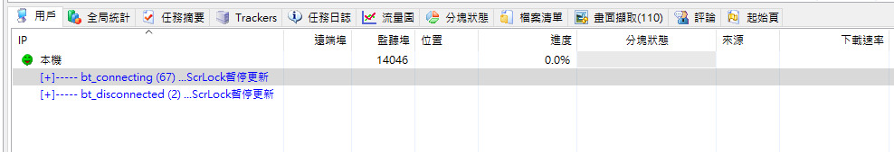
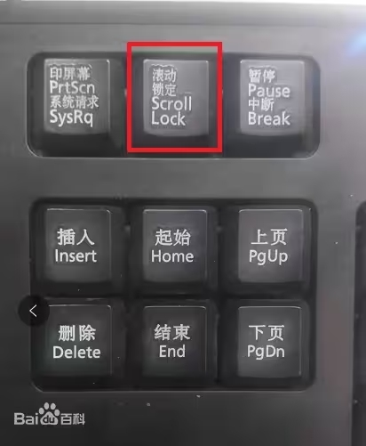

# 比特彗星常见问题-用户列表显示问题

**问：** 用户列表不刷新了/一片空白  

**答：** 应该是按到了键盘上的 **Scrll Lock 键** 即滚动锁定键  
再按一次即可恢复刷新 其一般用于 暂停列表更新以方便查看用户信息  

---

参考：  
* [cometbbs-求助，bt任务用户列表空白，或者显示暂停刷新！！](https://www.cometbbs.com/t/73190)
* [cometbbs-请问没有用户哪来的上下载量？附图](https://www.cometbbs.com/t/78332)
* [百度百科-滚动锁定](https://baike.baidu.com/item/%E6%BB%9A%E5%8A%A8%E9%94%81%E5%AE%9A/22785560)

