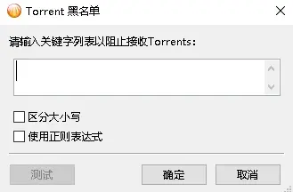
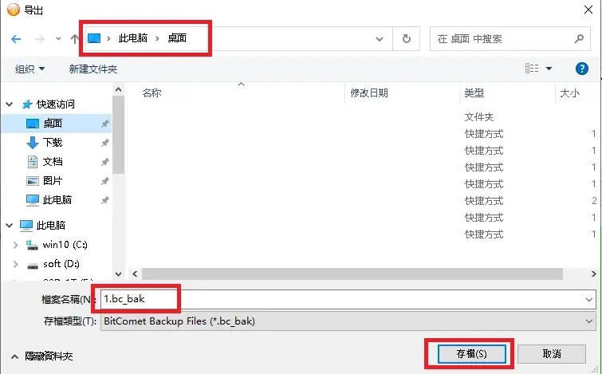
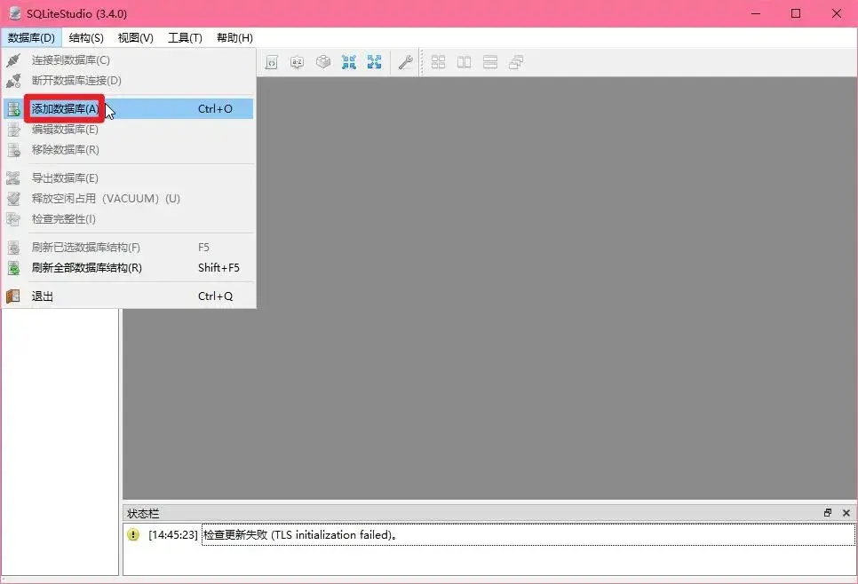
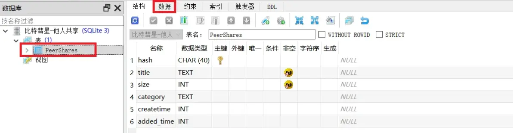
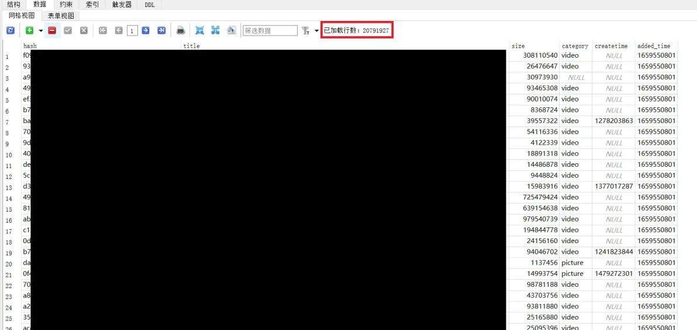
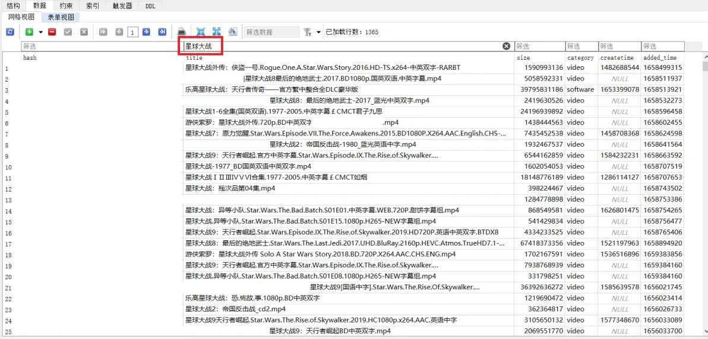
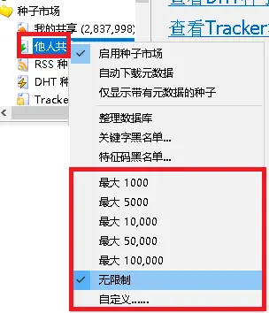

# 比特彗星常见问题-种子市场使用教程

2023.10.01  

**问：** 种子市场有什么用？  

**答：** 其相当于一个本地磁力/种子网站  
**里面包含各种各样的内容** 可以在里面搜索你感兴趣的内容  

### 种子市场

其包括：  
* **他人共享** （从其他比特彗星用户收集到的种子）
* **我的共享** （用户自己分享的种子 可被其他用户收集）
* **Rss种子** （从rss订阅源获取的种子）
* **DHT种子** （从DHT网络中获取的种子）
* **Tracker种子** （从tracker服务器获取的种子）

一般较为常用的是他人共享  
这些种子是由其他比特彗星用户产生  
我们之后讲解的主要是这个他人共享  

### 我的共享
当添加任务到比特彗星后会自动共享该种子  
私有种子不会被共享  

### DHT种子
从DHT网络中收集种子  
这些种子只有哈希值 想要查看内容必须下载元数据  

### Tracker种子
从tracker服务器获取种子 需要服务器支持  

---

**问：** 为什么我的比特彗星里没有种子市场？  

**答：** 若比特彗星检测到自己运行在国区 会自动隐藏种子市场功能  
若要使用种子市场 可以使用解锁版  
链接：https://wwkt.lanzoul.com/b03wrs5sj 密码:bc  

**问： 为什么种子市场里的资源下载不动？**  

**答：** 这些种子是由其他用户产生的 并不能保证这些种子的热度  
遇到无法下载的死种是很正常的事情  

**问：** 为什么里面有很多乱七八糟的东西？  

**答： 这些种子完全由其他用户产生（他人共享）**  
**无法控制这些种子的产生 因为无法控制其他人下载资源或制作资源**  

如果有你不喜欢的东西出现可以设置关键字黑名单加以屏蔽 支持正则表达式  
（右键弹出菜单以设置黑名单）或者自行接忽略  




---

**问：** 为什么种子市场占用这么多的内存、磁盘？  

**答： 目前彗星加载种子市场的方式是将所有内容读入内存中**  
所以会占用很多的内存 而磁盘占用高可能是与其他用户交换他人共享造成的  
可以通过加载其他人收集整理的数据库来减少磁盘的使用率 方法会在后面介绍  

**问：** 如何增加他人共享的数量？  

**答：** 可以通过直接导入他人收集的数据库 也可以通过挂机来收集他人共享  

**更推荐使用“断头档”即永远也下载不完的任务**  
这样各彗星客户端之间就可以一直保持连接  

并交换他人共享 ~~（使用方法在链接中）~~  
~~https://www.cometbbs.com/t/82968~~  

任务哈希值：（添加这些任务保持下载就能持续交换他人共享）  

```
2842c50d66d646d0068fb1e1a01296c25365408e
aa7eac0b6df2e41721069ec3f20601128abc7d97
5331c860e74a31566c229ee41f5d9137eefebb6b
602736d1501598b167ff93d79170b4c47beda038
26a781766531789936b8d80db85c533b6837f11f
bdf2d9605affc81cc4a5a6389d47a76ba3b70d15
e1c9ef19ba10bd3f47c9945176236440869e67a8
3ee539de4a4d0341ddcc1d9ec4cd1464c947b9f1
7d6162162c83624d9f3a16b2d3ec7d770c52e846
391e6fa68fb721ad70e82d2717ae8e21edd752c8
18688f6d06ed58b79179307bab3bf1f247a57998
```

**示例**  


**问：** 如何导入、导出他人共享？  

**答：** 有两种方法 **备份文件法** 和 **数据库替换法**  

**问：** 这两种方法有什么区别吗？  

**答：** 使用备份文件法可以保留之前收集的条目  
数据库替换法不会保留之前收集的 直接替换为了他人收集的内容

不过随着条数的增加 使用备份文件法 会造成软件长时间未响应 很容易失败  
而数据法其实也可以保留之前的条目 可对新旧两个数据库进行合并去重  
不过这并不在本教程讲解的范围内  
如果他人共享的条数超过5千条建议先看后面的数据库法  

**注意！**  
**建议将比特彗星软件本体和数据库放在固态硬盘中运行**  
**在机械硬盘中数据首次加载可能会非常缓慢**  

---

### 备份文件法

**导出：**
打开彗星 选择 文件>导入和导出下载列表  


选择 要导出的内容 这里只选择 他人共享 点击 … 选择保存路径  


选择 保存路径 输入文件名 点确定  


回到了刚才的界面 点击导出即可  


**注意 如果他人共享条数很多 软件很有可能会未响应或者卡死**  
**如果长时间卡死或者未响应 请尝试后面的数据库法**  

**导入：**  
使用.bc_bak 文件导入 和导出方法差不多  
打开彗星 选择 文件>导入和导出下载列表  


选择 **导入** 选项卡 点击 … 选择要导入的配置文件  
要导入的内容会 自动选择上 最后点击导入即可  


**注意 如果他人共享条数很多 软件很有可能会未响应或者卡死**  
**如果长时间卡死或者未响应 请尝试后面的数据库法**  

---

### 数据库法

**导出：**  
他人共享的内容其实是以 **数据库** 的形式存储在  
比特彗星安装目录\share\peer_shares.db  
找到这个数据库 **复制下来** 将这个文件以任何 **分享给其他人即可**  


**导入：**  
与导出方法类似 将别人分享的数据库文件复制到  
比特彗星安装目录\share 替换原有的peer_shares.db 数据库文件即可  

**注意操作时要退出彗星 不然会提示文件被占用**  
**覆盖原有数据库后 重新打开彗星 即开始加载 他人共享**  


--

**问：** 他人共享搜索时卡顿怎么办？

**答：** 当他人共享条数较多时就不推荐使用彗星内的搜索功能了  

建议使用数据库软件进行搜索 这里使用SQLiteStudio  
下载地址：https://wwkt.lanzoul.com/b03wtj00j 密码：sql  
此部分参考像素帝的教程：~~https://www.cometbbs.com/t/85757~~  

下载并解压缩 SQLiteStudio 打开 SQLiteStudio.exe  


首次运行时要选择语言  


**添加数据库**  


* **数据库类型：** 不用修改
* **文件：** 选择数据库文件所在的路径
* **名称：** 例如 比特彗星-他人共享
* **勾选**   记住此数据库

他人共享数据库位于 比特彗星安装目录\share\  
数据库名称为 peer_shares.db **最后点 OK**  


**查询数据库内容** 双击添加的数据库 连接并展开  


**展开 表** 并选择 **数据** 选项卡  





主要关注的是  
* **hash** 
* **title** 
这两列 即 **哈希值** 和 **标题**  

**注意** 当右上角的已加载行数 显示为转圈的时候  
表示正在加载数据 **请不要进行其他操作** 以防止软件未响应  
**当显示具体加载行数后方可进行其他操作**  

**注意！**  
**建议将数据库数和数据库软件放在固态硬盘中使用**  
**若在机械硬盘中读取可能会非常缓慢 即长时间转圈**  

**搜索数据**  

建议勾选 **在每个列上展示筛选器输入框**  
在 **title列** 进行搜索 可能比直接搜索更快些  




**下载内容**  
找到了合适的资源 **右键** 哈希值 选择 **复制**  
到彗星里点击 磁链 将复制的内容粘贴进去 点击确定 即可添加下载任务  

---

**问：** 为什么我的 数量始终不会增长？  
即使导入了别人上万条的收集 数量还是没有变化？  

**答：** 可能是限制了最大条数   
右键》他人共享》弹出菜单》调整最大条数 例如设置为无限  


---

参考：  
* https://www.cometbbs.com/t/85757


