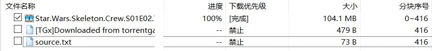

# 比特彗星常见问题-资源补档卡进度99%问题

2025.02.12  

## 关于资源补档

一些种子在创建一段时间后的 没有人上传了 但还有用户在尝试进行下载  
这种情况下就需要进行补档了  
当然如果是完全没有人下载的资源就没有没有补档的需要了  

方法也并不复杂 主要是通过过其他的渠道获得种子中的文件  
比如以其他形式分发的版本 例如网盘或HTTP  

或者使用迅雷之类的提供“离线下载”程序  
其离线下载服务器可能缓存了这些资源  
通过这些专用客户端 依然可以下载种子中的文件  

将下载到的文件 导入BT客户端后再进行上传 这样其他BT用户就可以进行下载了  
这个种子也算是救活了  

---

## 重新校验后 进度降为99.9%的原因

值得注意的是 在有些情况下 导入下载完成后的文件  
再进行校验 进度会变成99.9%而非百分之百  
这其实不算是一种BUG也不是下载的文件损坏了 **而是一个机制问题**  

### 分块机制

确切的来讲这涉及到**分块问题**  
在BT下载中文件被切割成了多个小块进行传输  

这一个个分块 就像一个个包裹一样  
每一个都包含所要下载文件的一部分数据 下载这些分块后  
全部拼起来 就得到了完整的要下载的文件  

而在切分文件的时候 其切割的方法 相当于把所有需要的文件串起来  
按照一定的大小进行切割 这样切出每个分块的大小都是相同的  
当然最末尾的分块除外  

**不过在多文件任务中就会遇到一个问题**  
**即两个相邻文件的首部和尾部的一部分 被切到了同一个分块内**  

这样一来这个分块（**后文简称边界分块**）就同时包含了前一个文件最后的一部分数据  
和后一个文件 刚开始部分的一个数据  

也就意味要想完整的下载完这前一个文件（**后文简称A文件**）  
必须要把后一个文件 开始的部分也下上一点才行（**后文简称B文件**）  

不然这个分块就通不过完整性检查 会被认为是不完整有问题的  
从而被整个丢弃  

### 正常下载和补档文件时的区别

当然这个问题其实在正常下载的的时候不是很明显  
如果A文件和B文件都是我们需要的 我们自然都会下载  
而在拼成完整的文件后就不存在这个问题了  

不过在现实中 种子文件中除了我们需要的文件外 还会有很多不需要的文件  
这些无用文件 我们自然不会去下载它 **但是如果分块分割问题**  
**（下文称分块对齐问题）出现在了我们需要的文件上会发生什么呢？**  

**比如我们只需要A文件 而选择不下载B文件 其实也不会有什么问题**  
BT客户端对去多下载B文件开头的一小部分 以保证 边界分块可以通过完整性检查  
这一小部分会被存储在临时文件 具体方法因客户端而异  

所以在正常通过BT下载的时候 其实不太会遇到这个问题  
但是在对资源进行补档的时候情况就不一样了  

在补档的时候我们会习惯性的去选择有用的文件  
而忽略那些无用的文件 这本身没什么问题  
**但是如果伴随分块对齐问题 情况就不一样了**  

依然使用A文件和B文件表示需要的和无用的文件  
补档是若只下载了A文件 那客户端在校验的时候  
最后一个分块会因为缺失B文件开头的部分而被丢弃  

**这就造成了补档时 导入的文件是完整的 但校验后**  
**进度反而变成了99.9%**  

### 补档时遇到此问题的解决方法

其实通过之前的讲解 我们已经确定了问题所在  
**即分块对齐问题 两个文件的部分数据被分到了一个分块内**  

那么在补档时最简单的方法就是：  
**在补档的时候将与有用文件相邻的无用文件也下载下来**  

注意！刚才所讲述的情况只是最常见的一种 实际情况可能比这个复杂  
无用文件可能存在于所需要的文件的前面  
以及和所需文件共用一个分块的文件不止一个  

**需要通过观察一下 文件选项卡 中的分块序号**  
**来确定需要额外选择的无用文件**  

**无用文件在尾部：**  

**尾部多个文件：**  

**首部和尾部以及多个文件：**  

根据实际情况选择选择额外的无用文件 同时进行补档  

### 具体操作方法

以比特彗星作为演示 建议开启 选项》为未下载完成的文件添加.bc!后缀  
这样可以方便的区分出 一个文件是否已经下载完成  

添加需要补档的种子 启动任务后马上停止  
只需让BT客户端创建目录和未完成的临时文件即可  
因为开启了 与预先分配磁盘空间 所以临时文件有完整的大小  

删除这些临时文件 将通过其他方式下载到的  
其对应文件复制到目录下  

回到客户端 选择任务右键弹出菜单 选择重新检查完整性  
进度应到达100% 可以开始上传  

当然有些时候 无用文件所占用的空间可能较大  
或者单纯是不希望无用文件存在于磁盘上 也可以将其清理掉  
方法也很简单 紧刚才的步骤 在任务进入上传后 取消勾选那些无用文件  

再次打开文件下载目录 会发现被取消的文件还在  
而且还多出来了 个`.piece_part.bc!`文件  

这个.piece_part.bc! **存储的就是边界分块中的内容**  
现在我们就可以删除那些无用文件 而不用担心边界分块未对齐问题  

---

## 解决分块未对齐问题的方法

事实上这个分块对齐问题并非无法解决  

### 分块填充文件

**分块填充文件就是一种解决方法**  

原理也很简单 即使用分块填充文件将A文件最后分块中  
剩余的空间占满以防止B文件的开始部分被切入到此分块中  
填充文件本身没有任何实际内容 仅用于占位  

**分块对齐后的文件序号：**  

不过分块填充的使用并不广泛  
最早使用分块填充的客户端 应该就是比特彗星了  
在0.86就开始引入 分块填充机制了  

**但是由于兼容性的问题 这个措施引起了极大的风波**  
因为那时只有比特彗星的客户端支持识别并忽略这些分块填充文件   

而其他不支持的客户端 在文件列表中会看到并下载这些  
无实际意义的填充文件 造成带宽和磁盘空间的浪费  

其实现代BT客户端基本都支持 处理分块填充文件了  
可以自动隐藏并将其排除下载  

而且分块填充也获得了BEP标准编号 [BEP47](https://www.bittorrent.org/beps/bep_0047.html)  
但该BEP规范至今依然处于草稿状态  

而在制作种子的时候基本都会会提供插入分块填充文件的选项  
**但这个选项默认是不启用的 大部分BT客户端和种子制作工具都是如此**  
在比特彗星中这个选项倒是默认启用的  

**也就意味着在网络上流传的大部分种子其实都是未对齐的**  

### BTv2协议

想要彻底解决这个问题还是要从BT协议上下手  
在切分文件的时候就避免这个问题  

好在随着BTv2 协议的出现这个问题已经被彻底解决了  
v2协议所做出的改变有很多 这里只讲和分块对齐有有关的  

在v2协议中修改了文件切分的方法进行了修改  
对每个文件进行单独切分 而不是像v1那样将所有文件串在一起切分  
这样就彻底解决了分块对齐问题  

**但v2协议的推广依然非常的缓慢 大量的客户端还不支持v2协议**  
无法下载使用v2协议的制作的种子  
**这样一来在未来相当长的时间中 这个问题依然会存在**  

