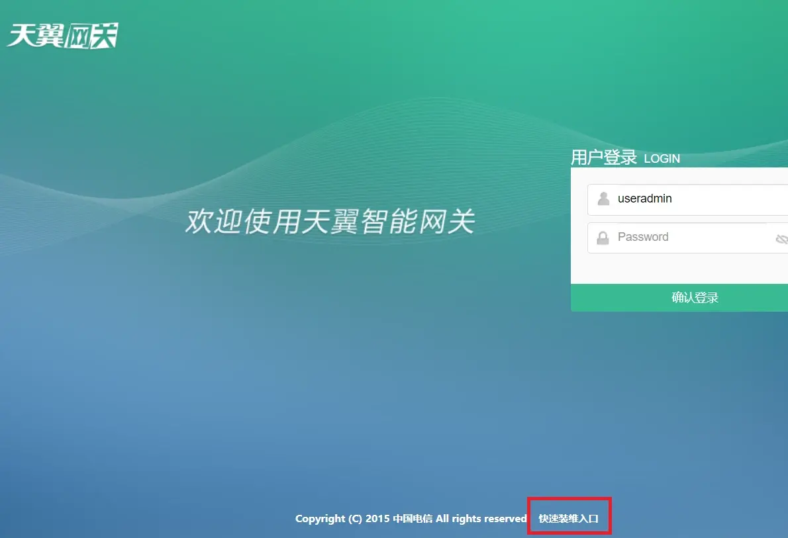
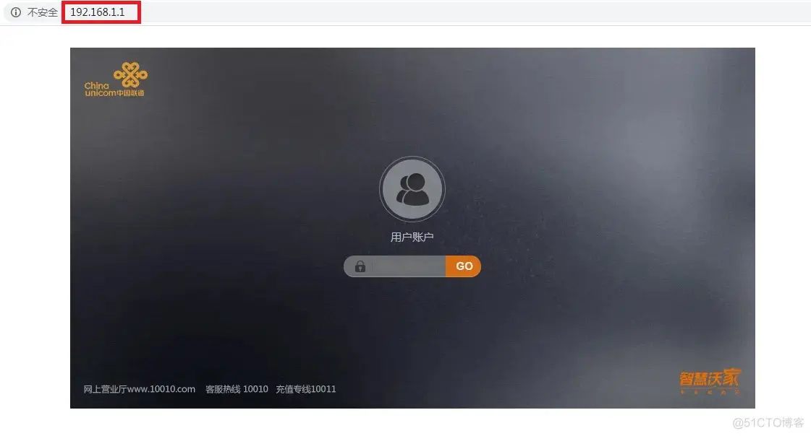
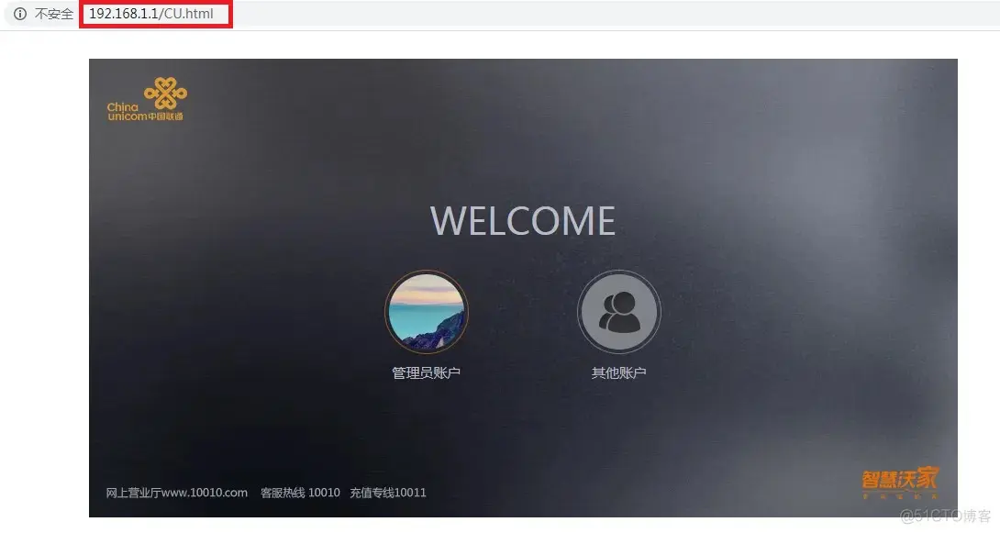
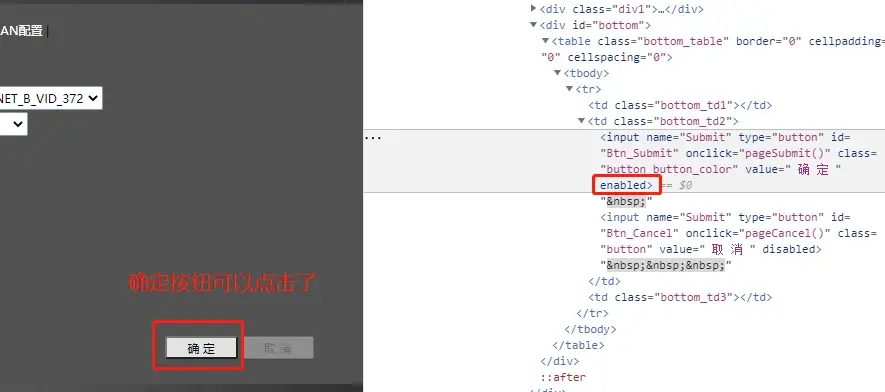
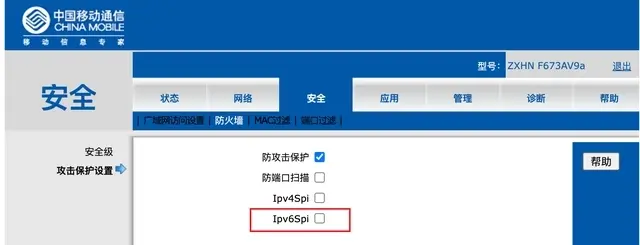
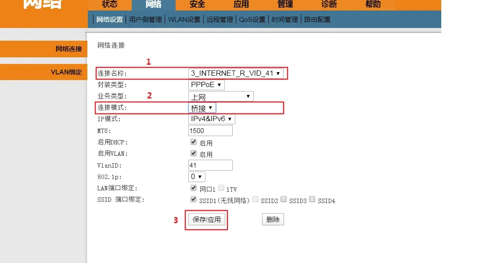
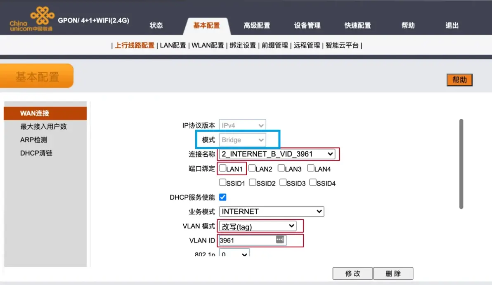
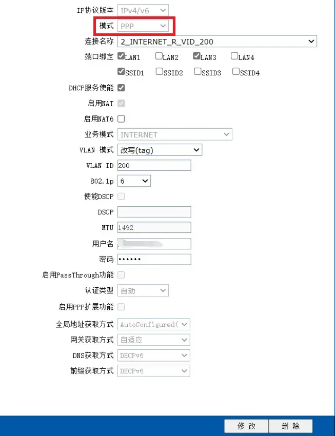

# 2.2 可用的解决方法 （光猫部分）

**问：** 既然有这么多困难我们该如何解决呢？（[在2.1节中](./BC阻塞_目标与困难.md)）  

**答：** 我们先从运营商 和 光猫来讲 最后讲 路由器 和 Windows上的 IPv6设置  

## 2.2.1-运营商NAT调整

由于运营商NAT用户无法直接调整  
**所以最好的解决方法就是 “开公网”**  
即让运营为你直接分配公网IP地址  

而不是通过运营商级NAT和其他用户共用一个IP  
**不过各运营商和各地区的情况不一样，IPv4公网 获取的难度也不同**  

**已知信息：**  

* 各类专线一般都有IPv4公网
* 移动的家庭宽带 不太可能获得公网IP 毕竟移动自己也缺  
可以考虑STUN穿透或者 IPv6（后文会讲）  
* 一些地区仅需通过客服电话和简单的理由如远程办公或者游戏联机  
即可获得公网需 要通过身份证号、手机号或其他信息进行身份验证  
* 一些地区需到线下营业厅办理 有可能要写保证书以保证不从事违法活动  
* 一些地区公网IP是一项独立服务 加钱即可办理  
* 一些地区运营商不愿意提供公网IP 也许可以到工信部去投诉不过比较麻烦  
* 还有一些地区直接分配公网IP无需任何操作  
* 目前一些地区已经开始进行IPv4公网IP回收 无法再通过客服等方式获取到公网IP  
已经获取到的公网IP也可能被收回  
* 使用 **上海电信的用户请注意**！ 上海电信所使用的SDN网关（光猫）较为特殊  
本教程中讲解光猫内容的部分不适应于上海电信SDN网关  

若出现无法获得IPv4公网的情况**请尝试使用STUN穿透或者设置IPv6（后文会讲）**  

---

## 2.2.2-光猫设置

### 2.2.2.1-超级管理员

**问：** 光猫设置困难性能差的问题该如何解决？  

**答：** 其实光猫方面的问题基本可以通过 **获取超级管理员 或者 改桥接来解决**  

**问：** 为什么要获取 **超级管理员？**  

**答：** 在光猫背后印刷的管理账户和密码 **一般权限都很低能修改的设置很少**  
需要有更高权限的管理账户来修改也就是常说的超级管理员账户  
有了超级管理员可**更好的设置光猫也包括改桥接**  

**超级管理员可以解决的问题：**  

* 运营商已经支持IPv6但在光猫设置中只启用了IPv4  
* 光猫IPv6防火墙阻止了所有主动入站连接  
* 修改光猫的工作模式 如路由模式改为桥接模式  

**问：** 如何获得光猫的超级管理员呢？

**答：**  
目前已知以下几种情况：  

* 光猫背面印刷的就是超级管理员  
* 光猫使用默认的超级管理员账户和密码  
* 光猫的管理员密码 是固定的但不是默认的  
* 动态密码  

**超级管理员的获取和登录决方法：**  

**默认的超级管理员账户和密码：**  

* 中国电信：telecomadmin / nE7jA%5m
* 中国联通：CUAdmin / CUAdmin 或 CUadmin
* 中国移动：CMCCAdmin / aDm8H%MdA 或 CMCCAdminWoTf6&$7

一些电信的光猫需要进入 **经典界面** 后输入才能登录超级管理员才效  
可以尝试在地址后添加8080端口 或者尝试使用下方的 运维/设备注册按钮  

```
192.168.1.1:8080
#注意 端口号为英文状态下的冒号
```
（不同型号的电信光猫经典页面的样式也不同 图片仅供参考）  




而一些联通光猫 **无法直接切换到管理员账户** 需要访问特定的地址  

```
192.168.1.1/cu.html
# 在地址后面加上 /cu.html 即可选择管理员账户
还有一些还需要 sessionKey 详情：https://zhuanlan.zhihu.com/p/655557411
```




* **非默认的静态密码**  
可以根据运营商加上光猫型号 在网上进行搜索  看看是否已经有人获取到了  
或者按照对应的教程进行破解 但随着光猫的固件更新 破解教程可能会失效  

* **动态下发**  
其密码类似于短信验证码 **是动态的**  
如果是这种情况可以尝试找 **安装师傅** 宽带报修 让师傅上门 问师傅  

* **淘宝破解**  
淘宝上一些店家声称可以破解/获取 超级管理员，可以尝试一下  
**在询问时最好加上准确的运营商和光猫型号或者直接拍摄光猫背后的信息给客服**  
如果以上方法都不行可行 也可以先继续看下面的内容  

---

### 2.2.2.2-启用IPv6（光猫）

目前三大运营商都 **已经支持IPv6不** 过在光猫的设置中**可能没有启用**  
需要手动启用IPv6 操作需要 **超级管理员权限**  


以 **电信** 的为例   
使用超级管理员登录后 点击上方的 网络 选项卡  
左侧选择网络连接 不同的运营商 不同的光猫 名称略有不同  

注意 **连接名称** 这一项 要**选择带Internet字样的**  
IP模式 改为 IPv6&IPv6 也有的显示为 IPv4/IP6  
修改完后点击 **保存**  

**其他常见的样式**  


---

### 2.2.2.3-解锁无法修改的选项

**注意！ 一些光猫即使在超级管理员权限下也不允许修改这些选项**  
即这些按钮、单/复选框、组合框 **为灰色无法点击**  

可以尝试在浏览器的开发人员选项中修改 其HTML元素进行解锁  
或者删除现有连接重新创建（在桥接部分后会讲）  

**灰色按键/选项解锁**  
按下F12 打开 开发人员选项 选择最左上角的那个小鼠标的按钮  
然后对着想要解锁的选项点一下  


控制台的中代码，会定位到选中组件的位置 如图红色方框的 "disabled"  
这里双击一下 进入编辑状态 **将其改成"enabled"** 输入完以后回车一下即可  
各种被禁用的 按钮、单/复选框、组合框 **一般都可以通过这种方式解锁**  



---

### 2.2.2.4-关闭IPV6防火墙（光猫）

有了超级管理员后就可以**关闭光猫内的IPv6防火墙**  
**不同运营商 不同型号和固件的IPv6防火墙位置和表示方法都不同**  
图中展示的是较为常见的形式  





**较为常见的的表达：**  

* **IPv6防火墙**  
* **IPv6 session**  
* **IPv6 spi**  

还有些时候 IPv6防火墙选项不会单独列出  
而是会被模糊的表示为 “攻击保护” “端口扫描保护”  

建议将光猫 防火墙选 项中所有能关闭的选项都关闭  
防火墙等级 能调多低 调多低 至于安全方面的问题可以看一下这篇文章  
[「特别篇」在关闭光猫、路由器IPv6防火墙后可能遇到的安全问题](./BC阻塞_特别篇.md)  

不幸的是 **一些光猫的IPv6防火墙无法关闭** 即使 使用超级管理员  
其在图形界面中根本没有设置的地方若遇到这样的情况 建议看下面 **桥接** 的内容  

---

### 2.2.2.5-光猫改桥接

**问：** 改桥接可以解决哪些问题？

**答：**  

可以解决：  

* **光猫性能差的问题**  
* **光猫IPv6防火墙**  

**问：** 改桥接为什么可以解决光猫性能差的问题？  

**答：** 改桥接后让光猫只负责光电转换，不负责路由功能减轻光猫的负担  

**问：** 改桥接后还可以通过光猫直接上网吗？  

**答：** 不能 改为桥接后光猫不负责拨号和路由功能了  
确切的来说是 **不负责PPPoE拨号功能** （有些地方可能已经在使用ipoe了）  
需要使用 **路由器** 来完成PPPoE拨号  

**问：** **PPPoE是什么？**

**答：** 简单的来说就是一种 **身份验证的方法** 就像网站上要注册登录那样  
有账户和密码 这样运营商就知道是你在上网了  
其称为 **上网账户/密码** 或者 **宽带账户/密码**  

要在路由器上选择上网方式为PPPoE **也有的叫宽带拨号**  
填写账户密码完成认证 后才能上网  

**问：** 这个上网的账户和密码在哪里看？  

**答：** 光猫上可能会贴一个纸上面会有 宽带的账户和密码  

**问：** 我这边好像没有  

**答：** 可以打电话问客服，可能需要提供 **电话号码或者身份号** 等进行身份验证  
**！如果要改桥接一定要先问清楚上网账户密码后再操作！**  

**注意！**
修改桥接后 **有小概率会降低网速**  
可能有以下原因 （不保证准确性）  

* **运营商限制**  
运营商不希望你改桥接 检测到你的光猫处于桥接模式 有意降低速度  

* **光猫的CPU性能实在太差**  
 一些光猫在路由模式下可以依靠硬件加速，而改桥接以后全靠 CPU 转发 导致速度下降  

 一些光猫 **直接修改路由模式为桥接** 会进入 **“软桥接”** 状态无法使用硬件加速  
 但是删除现有连接 新建一个后又可以使用硬件加速了  

* **光猫系统时间问题**  
一些光猫在改为桥接后无法通过 TR069 通道获取时间  
导致光猫的系统时间不准 从而影响了传输速率  

**问：** 改桥接也能解决光猫IPv6防火墙的问题？  

**答：** 是的 使用超级管理员可以关闭光猫的IPv6防火墙  
而修改为桥接后光猫不再负责路由 IPv6防火墙失去了意义 **相当于被直接绕过了**  

但有些光猫 **即使在超级管理员下也无法关闭IPv6防火墙**  
确切的来说是在图形界面下就没有关闭选项  
**只能通过桥接的方法来绕开IPv6防火墙**  

**问：** 改桥接，也需要先获取超级管理员才能改吗？  

**答：** 不一定，改桥接可以尝试联系客服让客服来改  

**问：** 那如何自己修改呢？  

**答：** 和之前启用IPv6的方式差不多 将 **连接模式** 修改改为 **桥接** 即可  
连接模式 有的直接显示为 模式 而 桥接 有些显示为 **bridge**  

一般来说 其他选项无需调整直接保存即可  
**不过还是建议在修改之前截图保存一下之前的配置会比较好**  





**问：** 如果要重新创建连接该如何操作呢？  

**答：**  可以按照以下步骤操作 需要超级管理员权限  
**！并截图备份好设置！设置错误会无法上网**  

使用超级管理员登录光猫后 切换到修改连接的页面  
基本都在 **网络选项卡** 下面的第一个小选项中 **不同的光猫显示的不一样**  

单击连接名称 **选择带有Internet字样的连接**  
**截图这个页面 以记录配置 之后要用到**  
截图完成后删除这个 连接

（以移动界面为例）


再次点开连接名称 选项 新建wan连接

* **模式：** 桥接（bridge）
* **接口绑定：** 以截图为准 未绑定接口会无法上网
 LAN对应光猫后面的物理网口 SSID 为WiFi
* **业务模式：** 上网（Internet）
* **VLAN模式： 以截图为准  (设置错误 会无法上网)**
* **VLNA ID： 以截图为准 (设置错误 会无法上网)**
* **802.1p：** 以截图为准  一般不用调整

完成后 点击 **创建** （保存/应用）  
**！注意若未删除旧的连接 就创建新的连接 可能会出现 LAN口无法绑定的现象！**


接下来需要 **在路由器上设置 拨号 **（下一章中讲解）  
**不同品牌的路由器 设置方法不同要根据实际品牌为准**  

**问： 要是改坏了没法上网怎么办？**  

**答：** 按照之前的备份的截图一个一个把 选项 **改回去**  

**问：** 要是改完了 **还是不行呢？**  

**答：** 那可能是 **有地方改错了** 要是自己发现不了的话 只能报修让师傅来改了  

---

参考：  
* https://blog.51cto.com/hatech/2521226
* https://www.idcbest.com/idcnews/11007620.html
* https://www.jb51.net/network/512428.html
* https://www.v2ex.com/t/958813
* https://cloud.tencent.com/developer/article/2154283
* https://danteng.org/peking-unicom-epon-tewa-800e-bridged/
* https://post.smzdm.com/p/a30eo9vr/
* https://www.right.com.cn/FORUM/thread-4095899-1-1.html
* https://drunkfish.me/modem/
* https://www.sciencesoft.cn/china-mobile-routing-to-bridge-mode/
* https://www.cnblogs.com/yaoyue68/p/16815152.html
* https://post.smzdm.com/p/a4pk5pr8/
* https://smb.tp-link.com.cn/service/detail_article_89.html
* https://bbs.360.cn/thread-15045395-1-1.html
* https://www.cnblogs.com/xuzy630/p/11281374.html
* https://www.luyouwang.net/8992.html
