# 「特别篇」在关闭光猫、路由器IPv6防火墙后可能遇到的安全问题

2023.08.02  

## 背景信息

随着IPv6的不断普及 目前三大运营商基本都已经提供了IPv6  
IPv6 拥有海量的地址数 一般不需要NAT转换 传输效率提升 不需要开通“公网”  
**“公网地址”直接分配到设备 对bt下载 开放端口 提供了极大的便利**  

### 遇到的问题

但大部分的光猫和路由器对IPv6的管理还不完善 **确切的来说是IPv6防火墙的管理不够完善**  
一般只有开和关两个选项 开启后会拦截所以主动入站流量即所以从外部主动发起的连接  

而关闭后则不会有任何过滤作用 无法精确的开放端口为了开放IPv6端口 供bt软件使用  
**我们目前在光猫/路由器上只能关闭整个IPv6防火墙**  

---

## 网络攻击

在家庭网络环境中较常遇到是 **端口扫描攻击** 和 **暴力破解攻击**  

**端口扫描** 用于探测哪些端口上有程序正在运行  
若发现可以用于获取用户数据或者设备控制权的程序  
则会尝试暴力破解密码进行登录  

若被扫描的端口上没有程序正在监听 则不会有危险  
安卓手机一般不会 开启对外服务 不太需要担心  
像bt客户端这类不能直接访问用户数据 获取设备控制权的程序 不需要太担心  

需要注意下列这些类型的服务：  
**其被破解后可能会造成数据泄露 和 设备被控制等风险**  
**Windows远程桌面 SMB文件共享 NAS管理界面 网络摄像头 SSH登录 等**

### IPv6相比IPv4的安全优势

1. **巨大的地址数量**  
 巨大的地址空间 使得逐个地址的扫描 难以实现  

2. **隐私扩展协议**  
 在IPv6中，原本使用EUI-64标识生成IPv6地址  

其是基于网络适配器的MAC地址 这使得设备的全球唯一标识  
与其网络通信的IPv6地址相关联 但可能泄露用户的位置和设备信息 
为了提高隐私保护，引入了一种临时地址生成机制 

在IPv6隐私扩展协议中 设备会生成临时IPv6地址 这些地址与设备的MAC地址无关且定期更换。
这样一来，设备的真实标识与其通信地址的关联性就被削弱，从而增强了用户的隐私保护。

**IPv6隐私扩展协议有两种形式：**  

* 临时地址（Temporary Address）：由设备生成临时的IPv6地址，与其MAC地址无关  
 这些地址在设备连接到网络时动态生成，并在一定时间后过期  
 每次重新连接到网络时，设备会生成新的临时地址

* 随机地址（Random Address）：与临时地址类似 但使用了随机数生成更为随机的地址  
 进一步增强了隐私保护 在大多数现代操作系统中  如Windows、Linux和macOS  
 IPv6隐私扩展协议默认是启用的，以增强用户的网络隐私保护  

### 防护手段

在IPv44时主要依靠NAT 流量需要通过NAT处理后到达内网设备  
内网设备隐藏在NAT后 外网设备是无法直发现内网设备  

若没有设置转发规则以开放端口 这些从外部发起的扫描会被直接丢弃  
不需要太担心 **防火墙的存在感被弱化了**  
**我们习惯了NAT的保护 以至于快忘记了防火墙的必要性**  

而在IPv6中一般没有NAT **主要依靠防火墙**  
**包括光猫/路由器上的IPv6防火墙和终端设备上的防火墙**  

默认情况下 光猫/路由器上的IPv6防火墙是开启的  
会拦截所有IPv6主动入站流量 也不需要太担心  

但由于之前所说的路由/光猫IPv6防火墙的管理不够完善  
为了开放IPv6端口 供BT软件使用  
我们目前在光猫/路由器上 **只能关闭整个IPv6防火墙**  
这样一来在路由设备上的防护就没有了  

**需要依靠终端设备上的防火墙拦截** 或者使这些有风险的服务不监听IPv6地址
若使用软路由 可以对IPv6防火墙进行更细致的控制 可开放单个端口  
目前已知 硬路由中 华硕路由器可以在IPv6防火墙中开放单个端口  

**请不要关闭终端设备上的防火墙**

---

## 目标与总结

从个人的经验和防火墙拦截记录来看  
**端口扫描的发起源主要是IPv4地址而IPv6的几乎没有**  

在巨大的地址数量和隐私扩展协议的加持下  
IPv6地址是不太容易被发现的  

但在BT下载时向tracker服务器汇报IP以及与其他DHT节点信息交换  
使得IPv6地址依然有可能被发现  

仍需做好防护准备 用防火墙“关闭”那些可能有危险的端口  
只要配置正确就不会有安全问题  

**目标：在已经关闭路由设备IPv6防火墙的情况下 设置好终端防火墙**  
**以防止意料之外的连接**  


### Windows 防火墙配置示例

在Windows上主要是封堵一些高危端口  

* TCP 135 139 445 3389
* UDP 137 138

这些用于网络共享功能和远程调用  
以及远程桌面的端口 一般被视为高危端口  

不过其中 139 137 138 为NetBIOS服务使用的端口  
其在IPv6已经不使用了 它们不会在IPv6地址上进行监听  

**我们需要注意的是:TCP 135 445 3389**

* 135 用于 Windows远程调用
* 3389 用于Windows远程桌面
* 445 用于smb文件共享

TCP 135和445端口 **默认只允许本地子网访问**  

3389 TCP 端口 用于远程桌面服务  
**防火墙上的默认规则允许所有地址访问 需要注意**  

**教程将展示通过配置Windows防火墙**  
**阻止公网IPv6访问3389端口**  


搜索栏搜索 **检查防火墙状态** 并打开  


检查防火墙是否启用  
并点击左侧的 高级设置 以打开高级widows防火墙  
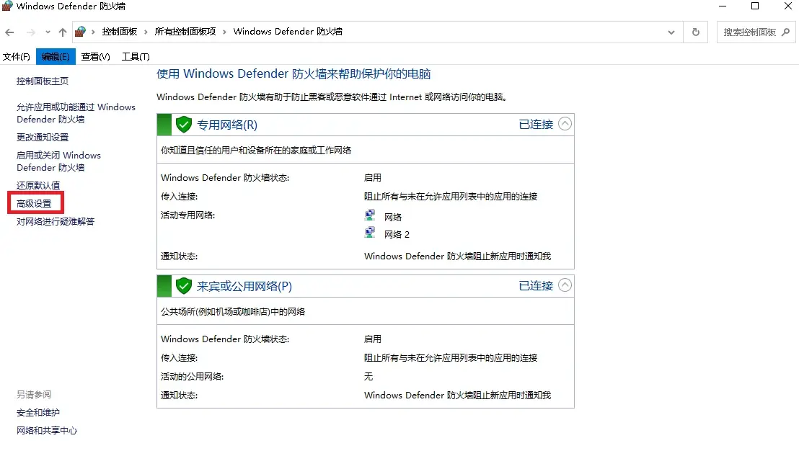

高级Windows防火墙  
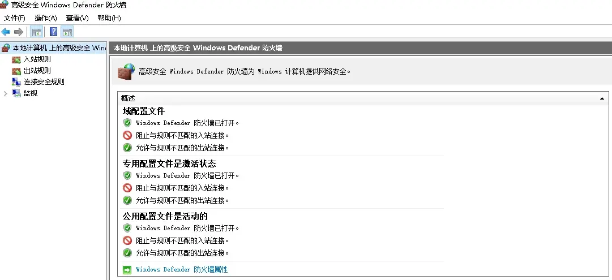

查看防火墙属性  
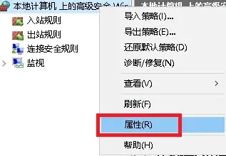

检查 **公用网络配置** 和 **专用网络配置**  
状态中的选项均为 **默认**  

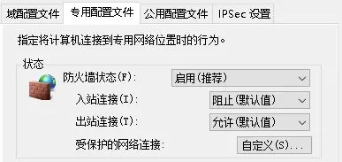


**添加规则**  
Windows防火墙上的远程桌面默认规则 是允许所有地址访问的  
通过添加规则 **禁止使用公网IPv6连接到3389端口**  


选择入站规则  
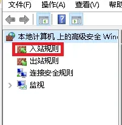

新建规则  
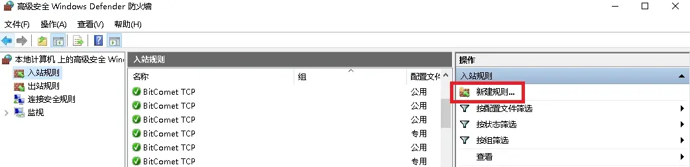

选择自定义规则  
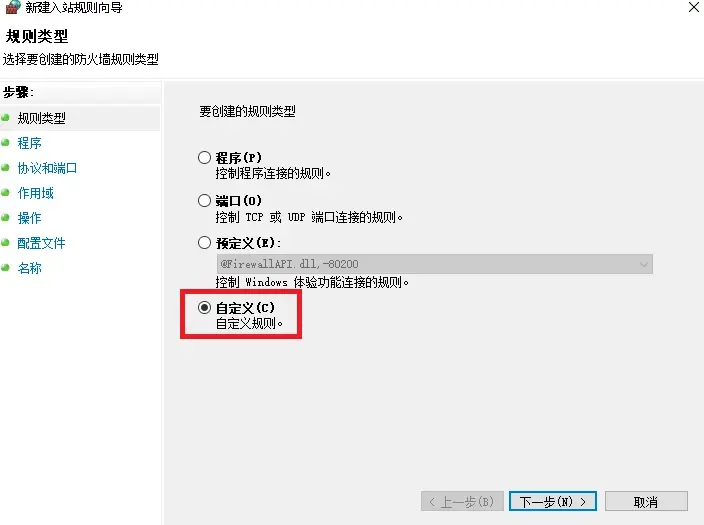

程序 保持默认  


协议选择TCP 本地端口选择 特定端口 端口号 3389  
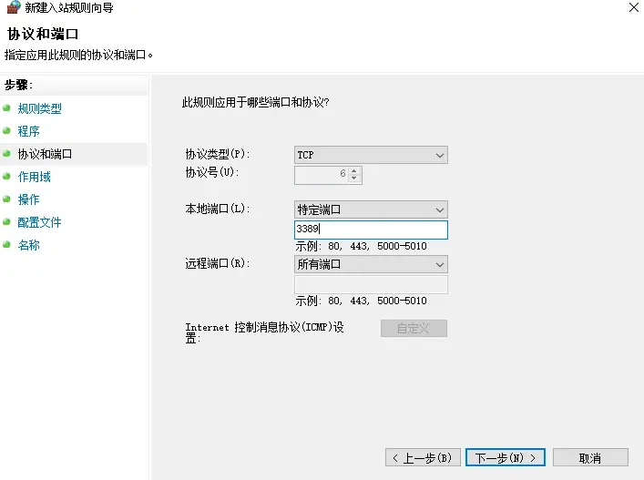

远程IP 选择 **下列IP地址** 并点击 添加  


填写 `2000::/3` 此为 IPv6全球单播地址的前缀 可以理解为匹配所有公网IPv6地址  
曾经尝试使用 `::` 进行匹配 但并不成功 其表示所有IPv6地址 IPv6前缀划分：[链接](https://www.iana.org/assignments/ipv6-address-space/ipv6-address-space.xhtml)  
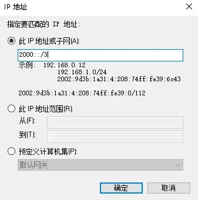


操作选择 **阻止连接**  
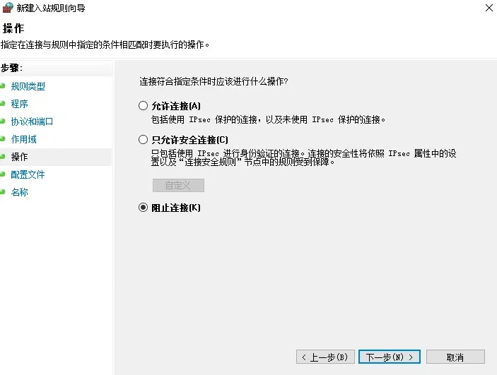

配置文件 保持默认  
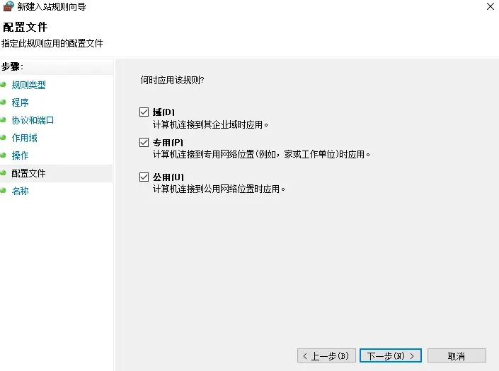

名称任意填写 这里使用 Block IPv6 TCP 3389  


点击完成 规则已经添加  


端口检查工具：[链接](https://zh.infobyip.com/tcpportchecker.php)  

**可通过命令快速设置 需要管理员权限**  

启用Windows防火墙：`netsh advfirewall set allprofiles state on`  

还原默认入站策略  
阻止与规则不匹配的入站连接  
```
netsh advfirewall set currentprofile firewallpolicy blockinbound,allowoutbound
```

封堵 TCP 3389 拒绝公网IPv6地址连接到本地的TCP 3389 端口  
```
netsh advfirewall firewall add rule name="Block IPv6 TCP 3389" dir=in action=block enable=yes profile=any protocol=TCP localport=3389 remoteip=2000::/3
```

