# 解决Softether开源版本中“不支持此功能。它尚未在开源版本上实施”的问题

转载/参考：  
https://kbssj.com/softethervpn/  
https://www.cnblogs.com/ip99/p/13991232.html  


---

Softether 在中国和日本有商业版贩售当开源版本检测到其运行在这两个地区时  
会自动限制部分高级功能 如静态路由推送。  

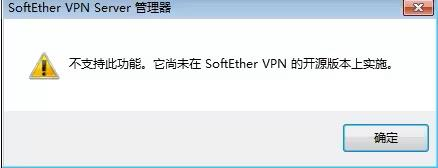


## 解决方法1 

从源代码编译 修改src/Cedar/Server.c  

GitHub项目地址：[链接](https://github.com/SoftEtherVPN/SoftEtherVPN/)


```
bool SiIsEnterpriseFunctionsRestrictedOnOpenSource(CEDAR *c)
{
    char region[128];
    bool ret = false;
    // Validate arguments
    if (c == NULL)
    {
        return false;
    }


    SiGetCurrentRegion(c, region, sizeof(region));

    if (StrCmpi(region, "JP") == 0 || StrCmpi(region, "CN") == 0)
    {
        ret = true;
    }

    return ret;
}

```

将最后一行的 **return ret** 改成 **return false**  


---

## 解决方法 2 

安装好服务端以后，修改目录下的“vpnsmgr_x64”和“vpnserver_x64”  
使用 x64dbg 调试工具打开程序   
工具官网：[链接](https://x64dbg.com/)  阿里云盘：[链接](https://www.aliyundrive.com/s/SSfU2Nyqigd)  


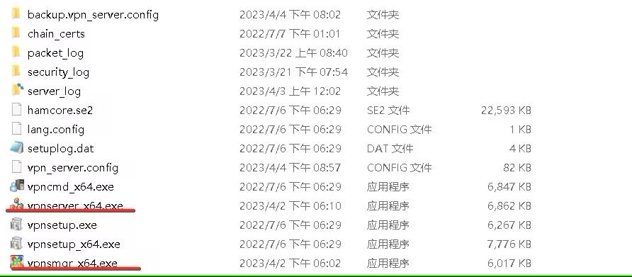


两个文件都需要修改 先打开 **vpnsmgr_x64**  
**右键空白处>搜索>所有用户模块>字符串**  

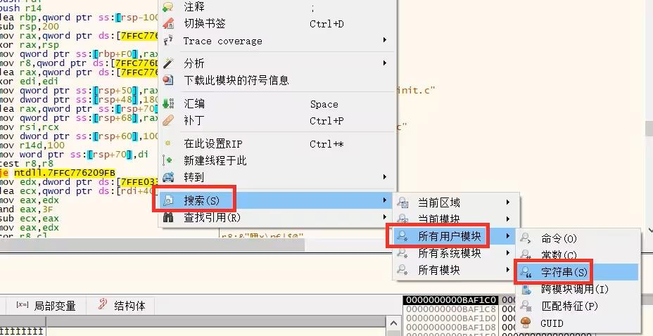


**在下方搜索框中输入CN（大写）**  

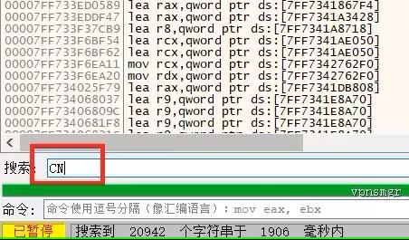

**选择第二个CN**  

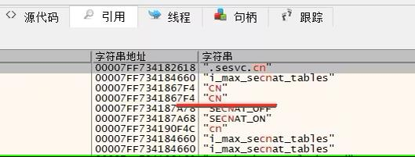

跳转到要修改的位置  

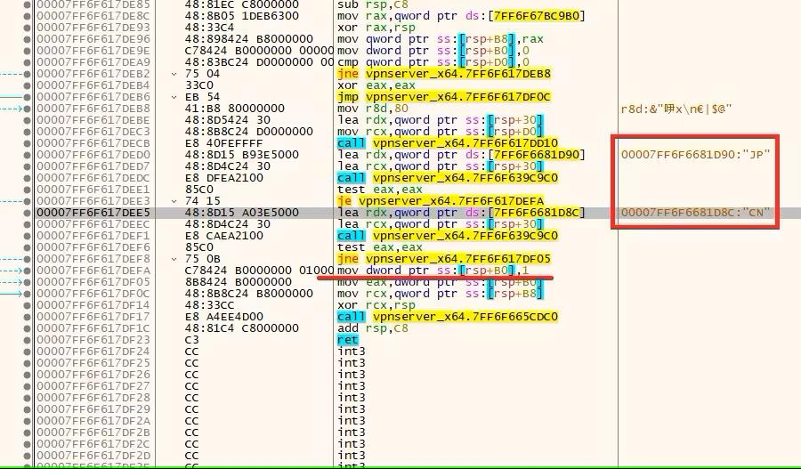

选中划线部分  
`mov dword ptr ss:[rsp+B0],1`  
右键>汇编  

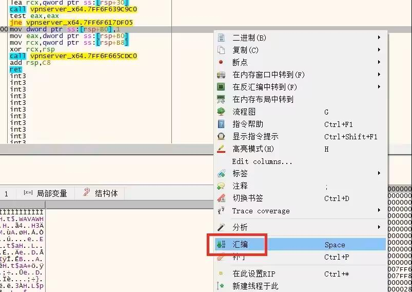

**将最后的0x1改成0x0**  

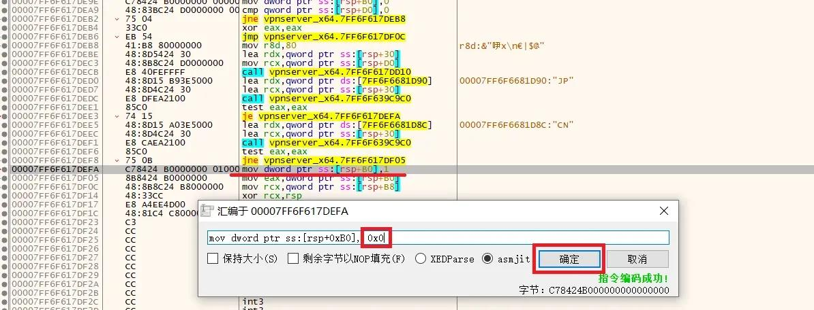

**修改成功后，开始制作补丁**  


**点击修补文件** 选择保存位置即可输出修改后的程序  

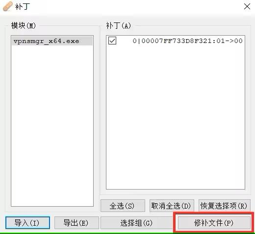

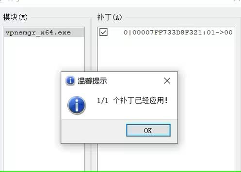

按照相同的方法修改**vpnserver_x64**  
将原有的程序替换为修改好的程序即可  
替换时要先停止服务，替换完成后再启动  

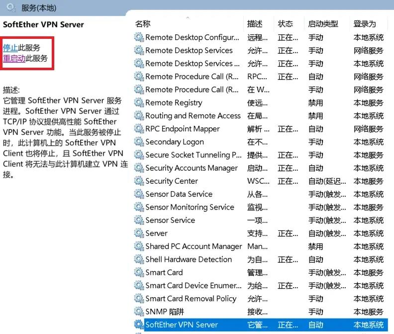


