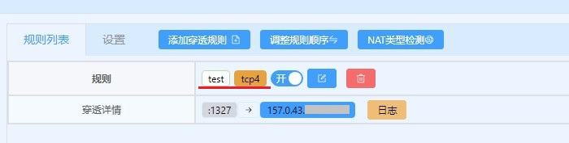
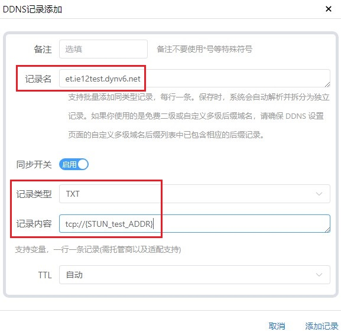
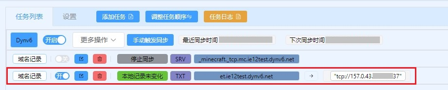
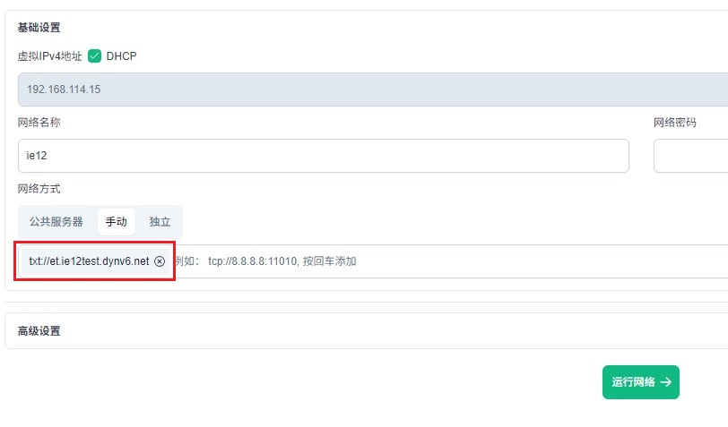
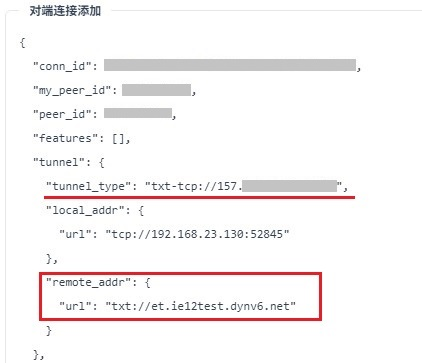
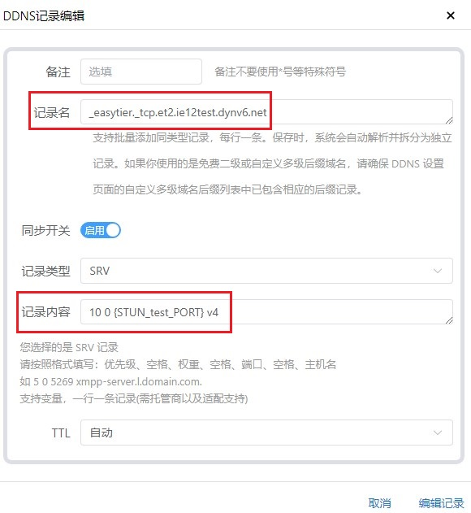
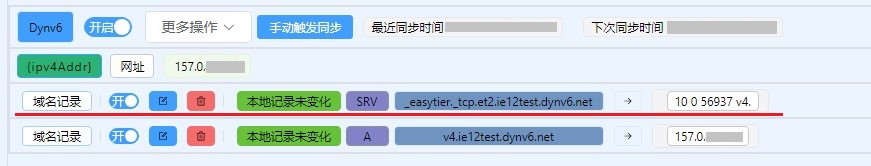
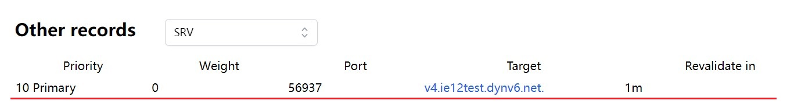
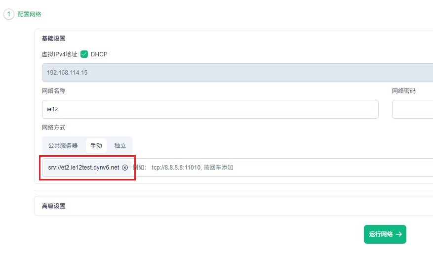
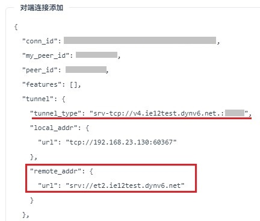

# 「EasyTier」使用SRV TXT HTTP重定向获取对端IP端口

## 关于此功能

在版本 [v2.2.3](https://github.com/EasyTier/EasyTier/releases/tag/v2.2.3) 中EasyTier添加了对SRV TXT 记录和HTTP重定向的支持  

这使得ET在连接其他节点时可以不直接指定端口号而是从DNS记录或者HTTP响应中获得  
此功能设计的初衷是与 NAT1 的 TCP 穿透配合使用（lucky）  

TCP穿透成功后可开放一个TCP端口 除了端口号不固定其访问效果和公网无异  
不过这个不定期变化的端口号 给其他节点的连接带来了很大的麻烦  

在端口变化后手动修改端口号过于繁琐  
我们可以从TXT SRV 记录和HTTP响应中取得这一端口号以实现完全自动化  
此方法在VNT上已经通过TXT记录实现：[教程](https://www.bilibili.com/read/cv39549245/?jump_opus=1)  

---

## 地址格式

其格式并不复杂以不同的协议头来区分  
通过这些记录和响应来获取实际要连接的地址和端口  

* TXT记录 `txt://example.com` 
* SRV记录 `srv://example.com`
* Http(s)响应 `http://example.com` `https://example.com`

---

## TXT 记录配置方法

TXT记录是最简单最灵活的方法 就像在客户端中连接时那样  
在TXT记录中写入 协议 地址 端口即可 `协议://地址:端口`  
例如：`tcp://et.ie12test.dynv6.net:11010`

得益于lucky的DDNS模块更新TXT记录的更新 大幅简化  
无需再向过去那样进行繁琐的配置  
使用lucky更新 TXT记录的具体方法:[教程](https://www.bilibili.com/read/cv41904858/?jump_opus=1)  

**STUN规则**  


**设置TXT记录更新**  


**检视更新效果**  


**连接测试**  


**连接成功**  


----

## SRV 记录配置方法

SRV 记录的配置方法与TXT相似不过会稍微复杂一些  
尽管SRV在设计时就考虑到了故障转移和均衡负载 但目前ET的SRV记录还不支持  
也许在未来会支持此功能 所以目前 权重 和 优先级 两项参数可以随意填写 无实际应用  

得益于lucky的DDNS模块更新SRV记录的更新也大幅简化  
无需再向过去那样进行繁琐的配置  
使用lucky更新 SRV记录的具体方法:[教程](https://www.bilibili.com/read/cv41904858/?jump_opus=1)  

ET目前支持的连接协议有：
* TCP
* UDP
* WS (Websocket)
* WSS (WebSocket Secure)
* WG (‌WireGuard)

但本质上就是TCP和UDP两种  
WS(S)以TCP为基础进行传输 而WG则是UDP  

以`et2.ie12test.dynv6.net`为例  
ET会自动尝试查询所有支持协议所对应的SRV记录  

```
_easytier._tcp.et2.ie12test.dynv6.net
_easytier._udp.et2.ie12test.dynv6.net
_easytier._ws.et2.ie12test.dynv6.net
_easytier._wss.et2.ie12test.dynv6.net
_easytier._wg.et2.ie12test.dynv6.net
```

我们在设置的时候只需要选择其中一种协议即可  
此处使用TCP协议进行演示  

值得注意的是SRV记录中**主机名字段只能使用域名**  
**不能使用IP地址** 而且这个域名需要直接指向IP地址  

也就是说这个域名应该是一个 A记录（IPv4）或一个 AAAA记录（IPv6）
其
不能是 CNAME 详见：[链接](https://www.cloudflare.com/zh-cn/learning/dns/dns-records/dns-srv-record/)  

**STUN规则**  


**设置SRV记录更新**  


**检视更新效果**  


**解析效果**  


**连接测试**  


**连接成功**  


---

## HTTP 响应

ET支持从 HTTP 200 和 30x 重定向 中获取要连接的IP和端口  

### HTTP 200 响应

一个简单的纯文本网页

内容依然是协议 地址 端口

可以使用lucky 制作一个极简的网页

### HTTP 30X 重定向

HTTP重定向中又分为两种
一种是从url中直接获取

查询字符串


