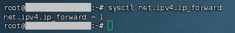
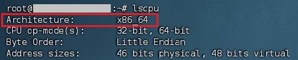
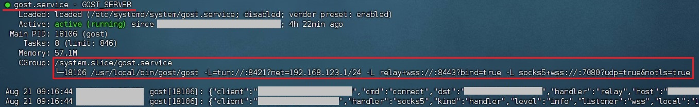
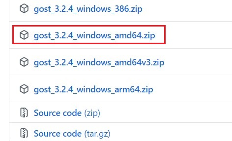
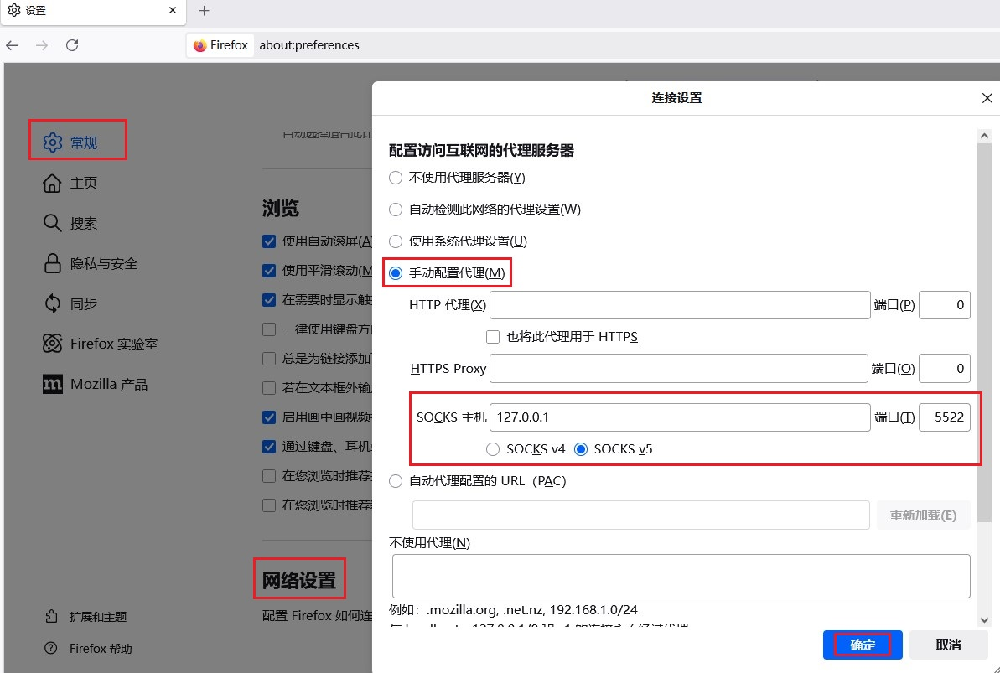
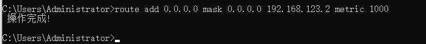
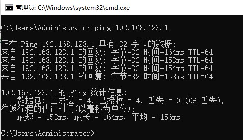
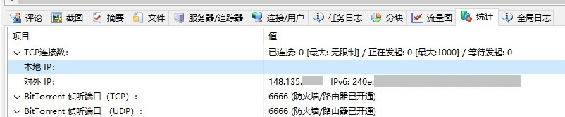
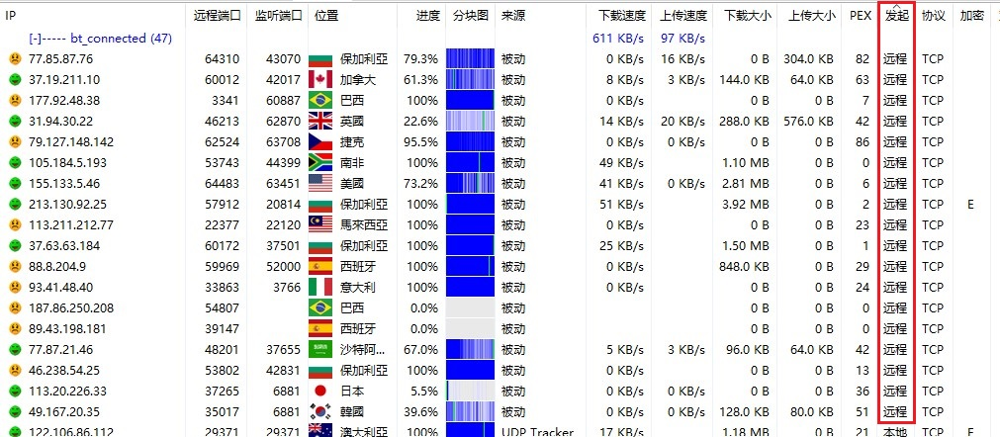
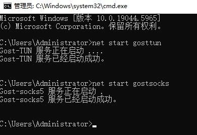

# 使用Gost替换Frp实现内网穿透为BT下载开放端口

## 背景信息

在本教程将使用gost替代frp来为bt客户端提供穿透  
在之前的教程中我们已经实现了通过stun穿透运营商NAT  
为BT客户端开放端口 [链接](https://www.bilibili.com/read/cv31006420/)   

但是此方案只使用于全锥形的运营商NAT  
且没有配置防火墙的情况的情况  
事实上现实中的情况非常的复杂 该方案并不总是能成功  

尤其是随着对PCDN的严打  
越来越多的地方运营商使用对称形NAT和关闭IPv6的方法  
对PCDN实施打击  

这使得stun方案不再可以用  
中继方案几乎成为了开放端口唯一的方法  

---

## Frp 方案的弊端

frp穿透方案已广泛使用于各类场景  
其配置起来也不算是非常复杂  

尤其是在有第三方的图像界面和配置生成器辅助的情况下  
其可以胜任大部分的穿透场景  

### 源IP和端口问题

但是frp方案存在一个致命的缺陷  
**即其在应用层对流量进行转发 这会导致连接的源IP和端口号丢失**  
这样一来通过frp穿透后远程传入的流量都会变成来自本地frp客户发出的  
源地址为`127.0.0.1`的本地流量  

其实这对大部分的程序和应用来说不是个问题 毕竟只要连接可以接通就行了  
至于来源是来着本地还是远程并不重要  

但对BT客户端来说情况就不一样了  
这样一来在BT客户端中显示的其他用户的IP地址都会变成本地环回地址  
当然如果只是看起来有些奇怪 倒也无妨  

**更大的问题是这会影响反吸血的效果**  
确切的来讲是类似于[PBH](https://github.com/PBH-BTN/PeerBanHelper)的较为复杂的外置反吸血程序  
像比特彗星和其他一些客户端中所内置的较为简单的反吸血功能不太会受影响  

这又要从PCDN问题开始讲了  
简而言之这个和PCDN所使用的刷流方法有关系  

其会在同一IP不同端口上发起多个线程进行下载  
并丢弃下载到的数据 因为他们的目的只是提高自己宽带下载流量   
关于PCDN刷流对BT反吸血带来了新的挑战在之后的文章可能会进行讲解   

而在通过frp转发后所有用户的源IP都会变成本地地址  
**使得外置反吸血程序无法识别这些多个线程刷流行为**  

### 附加代理问题

在使用frp转发BT流量的基础上  
我们还需要为BT客户端设置代理  
这和BT客户端向 tracker 的汇报有关系  

若不通过代理连接tracker服务器 则在tracker服务器上  
记录的仍然是**客户端所在的本地对外IP** 而非穿透服务器的IP  
这样一来其他客户端在连接的时候依然会其他客户端依然会尝试连接这个本地对外IP  
而非可以连接的穿透服务器IP  

所以让bt客户端通过代理来连接tracker服务器是必要的  
frp本身并不支持代理功能 需要安装其他的代理服务端程序  

---

## Gost方案所解决的问题

相比起frp方案存在的这些弊端  
Gost方案可以有效避免这些问题  

Gost使用go语言编写 集成了非常多的网络功能  
官方文档：链接

### 可保留源IP

事实上本方案中不使用gost的自身的端口转发功能  
其本质上也是在应用层进行转发 也会造成源IP丢失  

流量转发功能由iptable或nftable承担  
gost负责建立隧道和创建虚拟网卡  

将gost和iptable或nftable配合使用可以达到  
类似于传统VPN的效果 但又不完全一样  

其实frp也支持传递原始IP 但依靠的是 [Proxy Protocol](http://www.haproxy.org/download/1.8/doc/proxy-protocol.txt) 实现的  
其应该是通过在标准的TCP首部之前插入额外的字段来传递真实IP  
**这需要穿透后的客户端支持解析这些额外字段**  
如果客户端不支持解析这部分内容 那连接便会发生错误  

而使用iptable或nftable的转发过程  
对应用程序来说是透明的 客户端程序无需做任何额外的适配  

这也使得此方案不仅适用于BT下载穿透  
也适用于其他需要保留源IP地址的场景  

### 集成代理功能

Gost集成了代理功能 其中包括socks5  
这样一来UDP tracker和 http(s) tracker 都可以通过代理连接  

除此之外其还支持一定的**分流功能**  
可以实现在连接IPv4 tracker 服务器时通过代理  
而在连接IPv6 tracker时则通过本地发起  
这在本地有IPv6且端口开的时候非常有用  


### 更高的转发效率

相比起frp自身的转发功能 由iptable或nftable进行转发 效率会更高  
gost的隧道部分则是基于 wireguard-go 实现的 其运行在用户空间的  
这相比官方版本运行在内核wireguard 效率略低 但其仍然十分可观  


---

## 工作流程

感谢[泥浆](https://space.bilibili.com/14913)提供的技术支持  

**示意图**


## Linux服务端布置

**为方便之后的设置 这里推荐使用 finalshell 作为 ssh连接工具**  
**使用 Notepad3 作为文本编辑工具**

### 开启Linux 内核转发功能  

编辑 `/etc/sysctl.conf` 文件  
写入 `net.ipv4.ip_forward = 1` 以开启转发功能  

可以将 sysctl.conf 下载到win上 修改后再上传  
**需要注意换行符 Windows的换行符和Linux下的换行符不一样**  


当然也可以使用直接在终端中使用文本编辑器进行编辑  
这里推荐使用近似图形界面的编辑工具 **nano**  

输入 `nano 文件路径` 以编辑文件  
Ctrl + O 保存文件 保存时需要再次确认路径  
Ctrl + X 退出编辑器  


使用 `sysctl –p` 重载文件使配置生效 此命令无输出  
输入 `sysctl net.ipv4.ip_forward`以检查值  


### 配置 NAT 规则

**安装iptables**

**不同的Linux发行版使用的包管理器不同**  
所对应的命令也不同 使用 `uname -a` 查看Linux发行版本  

**添加转发**  
逐条输入并回车 以添加规则  
```
iptables -t nat -I PREROUTING -p tcp --dport 6666 -j DNAT --to-destination 192.168.123.2:6666
iptables -t nat -I PREROUTING -p udp --dport 6666 -j DNAT --to-destination 192.168.123.2:6666
iptables -I FORWARD -d 192.168.123.2 -j ACCEPT
iptables -I FORWARD -s 192.168.123.2 -j ACCEPT
```

其中前两条规则用于将 发到VPS的6666TCP和UDP端口的流量  
NAT转换到 `192.168.123.2` 的6666TCP和UDP  

这里的 `192.168.123.2` 是之后 BT客户端将使用的IP
而6666则是BT需要监听的端口 这个IP和端口可自定义  

而后两条则分别是 放行源地址为任意 目标IP为`192.168.123.2`的流量  
以及放行 源地址为`192.168.123.2`目标地址为任意 的流量  

即允许内部的 `192.168.123.2` 主动访问外部网络  
也允许外部网络的流量到达 `192.168.123.2`  

如果有多个客户端的话 这里其实可以使用虚拟TUN接口名称  
这样无需为每个客户端的IP都设置转发  
可参考：[链接](https://gost.run/tutorials/tuntap/#_8)

不过我们这里只有一个客户端 
而且这样可以防止被其他IP偷走流量  
**就算被人连上了 如果没有正确的IP地址 也无法连通**  

使用 `iptables -L` 检查已经添加的规则  
默认只列出 filter 表  


而 DNAT 是在 nat 表里面的  
需要使用 `iptables -t nat -vL`  


若要删除这些转发条目只需要将原先命令中的"I"都替换成"D"  
再次运行即可 注意是大写字母  

### 下载Gost

查看 CPU 架构 输入 `lscpu`  



Gost GitHub 仓库：[链接](https://github.com/go-gost/gost/releases)  
下载 gost 建议放在 `/usr/local/bin`  
可下载文件到win上 解压并重命名后上传  

或者直接在Linux上下载 使用 wget  
`wget -O /usr/local/bin/gost.tar.gz 要下载的连接`

**示例**
```
wget -O /usr/local/bin/gost.tar.gz https://github.com/go-gost/gost/releases/download/v3.2.4/gost_3.2.4_linux_amd64.tar.gz
```


**查看目录下文件**
切换目录 `cd /usr/local/bin/`
列出目录下载的文件 `ls -l`  


**创建gost文件夹**  
`mkdir -p /usr/local/bin/gost`  

**解压文件**  
`tar –xzvf 文件名 -C 解压路径`  

**示例**  
`tar -xzvf gost.tar.gz -C ./gost/`  


### 设置Gost参数

Gost 官方教程：[链接](https://gost.run/tutorials/tuntap/)  

此处需要设置一块tun网卡以及用于传输流量的隧道  
还有用于传递tracker消息的 socks5 服务端  

隧道本身使用UDP协议进行传输  
可以使用gost内置的转发器将其转换成其他协议  

此处将使用转发器将UDP转换成wss协议  
为提高连通性同时也将socks5协议也转换成wss  

**示例参数**  

```
gost -L=tun://:8421?net=192.168.123.1/24 -L relay+wss://:8443?bind=true -L socks5+wss://:7080?udp=true&notls=true
```


各端口号和转发协议可自定义 此处使用8443作为隧道最终的隧道端口 
7080为socks5服务端端口 wss作为转发协议  

此处socks5的服务端未开启认证  
由于其套上了一层 wss 这使得常规的 socks5 客户端无法连接  
故无需开启认证功能  


### 开放本机端口

为隧道和socks5服务端开放端口  
端口号和协议根据实际情况填写  

**示例**
```
iptables -A INPUT -p tcp --dport 8443 -j ACCEPT
iptables -A INPUT -p tcp --dport 7080 -j ACCEPT
```

### 测试服务并检查端口

测试参数运行效果并检查服务端各端口是否开放  

切换到 gost所在目录 此处为 `/usr/local/bin/gost`  
`cd /usr/local/bin/gost`  

运行gost并附加之前准备的参数 `./gost 参数`  

此处为  
```
./gost -L=tun://:8421?net=192.168.123.1/24 -L relay+wss://:8443?bind=true -L socks5+wss://:7080?udp=true&notls=true
```

检查输出内容是否有报错  


**检查端口**  

使用在线TCP端口扫描端口工具 检查端口  
工具链接：[链接](https://zh.infobyip.com/tcpportchecker.php)  


### 注册Linux系统服务

在终端中直接运行程序 会占用终端无法进行其他操作  
且关闭终端后程序会退出  
而注册成服务即可实现开机自启动和后台运行  


**创建服务配置**

方法参照上文中修改 sysctl 的方法  
存放路径为 `/etc/systemd/system/` 文件名 `gost.service`  
即 `/etc/systemd/system/gost.service`  

写入以下内容：  

```
[Unit]
Description=GOST_SERVER
After=network.target

[Service]
Type=simple
ExecStart=/usr/local/bin/gost/gost -L=tun://:8421?net=192.168.123.1/24 -L relay+wss://:8443?bind=true -L socks5+wss://:7080?udp=true&notls=true
Restart=on-failure
RestartSec=10s

[Install]
WantedBy=multi-user.target
```

其中最重要的部分为 `ExecStart`  
**填写gost主程序所在的绝对路径 外加启动参数**  


重新加载服务配置文件  
`systemctl daemon-reload`

启动服务  
`systemctl start gost`

查看服务状态  
`systemctl status gost`


检查服务状态 和 服务日志内容  



---

## Windows客户端布置

在设置完成服务端后 接下来设置客户端  


### 下载gost

Windows一般选 Windows_amd64 不要选 amdv3  
看清是 AMD64不是ARM64  



在Windows下使用TUN网卡还需要下载wintun 下载地址：[链接](https://www.wintun.net/)  
打开压缩包的bin文件夹 根据系统架构选择对应的版本 一般选择amd64  
将其中的wintun.dll文件复制下来与gost.exe放置在同一目录下  


### 测试效果

测试与服务端进行连接情况  
命令提示符加参数运行 检查输出内容是否有报错  


**示例参数**  


socks5本地服务端  

```
gost.exe -L socks5://:5522?udp=true -F "socks5+wss://服务端IP:7080?notls=true&bypass=~0.0.0.0/0"

```

TUN网卡和隧道  

```
gost.exe -L="tun://:0/:8421?net=192.168.123.2/24&name=gost_tun" -F relay+wss://服务端IP:8443
```

两个功能放在一个进程运行时 似乎会产生问题  
此处将其分解到两个进程 分别运行  

分别在两个命令提示符窗口中 加参数运行gost.exe  
本地端口号可自定义 远程端口号要与服务端设置的相应的  

创建TUN网卡 设置IP为`192.168.123.2` 隧道本地端口8421（UDP）  
此处name用于指定TUN网卡的名称（可选）
使用转发器通过WSS协议转发到服务端的8443端口  

socks5本地服务端监听5522端口 启用UDP  
使用wss协议转发到远程服务端的7080端口  
由wss复杂负责加密 故关闭socks5自身加密功能（与服务端对应）

**注意tun网卡和socks5转发部分的命令 使用了双引号进行包裹**  
**这个因为在批处理中单个 "&" 符号用于在单个命令行中串联多个命令**  
若不使用双引号将其框定为一个整体 则命令提示符会认为其是多条命令 从而逐条运行  

bypass部分用于实现IPv4和IPv6的分流  
IPv4流量通过socks5代理 而IPv6直接从本地发出  


**测试socks5代理效果**  

**建议使用火狐浏览器 其可以非常方便的设置代理功能**  
通过浏览网页来测试代理是否可以接通  



**IPv6分流测试**  

访问纯IP测试站点 例如 `ip138.com`  
测试出的对外IPv4地址为Linux服务器的地址  

而IPv6地址则是本机对外IPv6地址  
**若本地设备无IPv6 则跳过此步骤**  


**测试虚拟网卡**

添加路由条目 **需要再tun网卡创建后再添加**  

```
route add 0.0.0.0 mask 0.0.0.0 192.168.123.2 metric 1000
```

该路由可以使本机对远程传入连接的响应 正确的发回到服务端  
若无此条路由则本机的回应 无法传回 端口依然阻塞  

此处直接用`192.168.123.2`（虚拟网卡地址)做网关 这样就可以减少ARP请求  
跃点数设置的很大 使此条路由表的优先级低于正常上网流量的路由  
以防止影响正常上网  



检查路由表 `route print -4`

**接口一项 显示 "在链路上" 即为正常**  
**若显示 IP地址 则说明 路由在 TUN 网卡创建前就添加了**  
其是无法正常工作的 需要删除 将原先添加命令中的 add 换成 delete 再次运行  


**ping对端**  

ping 服务端虚拟网卡使用的IP 应有回应  




**测试连通性**

在确定隧道和代理畅通 以及添加路由表后  
就可以打开 比特彗星进行测试了  

修改 比特彗星 监听端口 为6666 对应iptables 上的NAT转发端口  


**设置代理服务器**  

**服务器类型：** socks5  
**IP地址：** `127.0.0.1`  
**端口：** 本地socks5服务端口  

勾选：  
* **使用代理端口转发检测**
* **使用代理连接tracker**


点击右下角的黄灯选择重新检查端口 重新检查后 应变成绿灯  
且显示的外网IP应该会变成 Linux服务器的IP 由于使用了代理 内网IP无法检测会显示为空  




下载任意热门种子 例如 [乌班图镜像](../比特彗星-常见问题/BC下载测速.md)  
查看 **用户选项卡** 中的发起列 若看不到发起列 则需要右键表头弹出菜单勾选发起  
**若有远程发起 且传入用户的IP显示正常 则穿透功能已经实现**  




### 设置启动脚本


**创建用于添加 路由条目的 批处理**  
文件名 route_add.cmd  
与gost.exe放置在 同一目录下

```
@echo off
ping /n 10 127.1 >nul
route add 0.0.0.0 mask 0.0.0.0 192.168.123.2 metric 1000
```

由于从gost开始运行到TUN网卡创建完成 有一段时间的延迟  
**而该路由条目需要在TUN网卡创建完成后再添加**  
故通过ping一个无法ping通的地址来卡住脚本 以实现延迟  


**创建gost运行脚本**

由于将tun和socks5放在同一进程里运行似乎会出现问题  
这里将隧道服务和socks5服务拆分成两个  

分别为gost-tun.cmd和gost-socks5.cmd  
一样存放在gost.exe的目录下  


gost-tun.cmd内容  
```
@echo off

start gost.exe所在的实际绝对路径\gost.exe -L="tun://:0/:8421?net=192.168.123.2/24&name=gost_tun" -F relay+wss://服务端IP:8443

pause

```

**示例**  

```
@echo off

C:\Users\Administrator\Desktop\gost\gost.exe -L="tun://:0/:8421?net=192.168.123.2/24&name=gost_tun" -F relay+wss://服务端IP:8443

pause

```


gost-socks5.cmd内容  

```
@echo off

gost.exe所在的实际绝对路径\gost.exe -L socks5://:5522?udp=true -F "socks5+wss://服务端IP:7080?notls=true&bypass=~0.0.0.0/0"

pause

```

**示例**  

```
@echo off

start C:\Users\Administrator\Desktop\gost\gost.exe -L socks5://:5522?udp=true -F "socks5+wss://服务端IP:7080?notls=true&bypass=~0.0.0.0/0"

pause

```


### 注册Windows服务

使用winSW将gost注册服务 方便自启动和启停控制  
下载winSW的方法参考之前的教程：[链接](./win搭建easytier公共服务器.md)  


**创建winSW服务注册文件**

将WinSW-x64.exe复制到gost目录下  
并将隧道功能和socks5功能所对应的批处理分别注册成服务  

配置文件名称与其批处理名称相对应  
分别为gost-socks5.xml和gost-tun.xml  

gost-socks5.xml内容  
```
<service>
  <id>gostsocks</id>
  <name>Gost-socks5</name>
  <description>Gost_For_Bittorrent</description>
  <executable>实际路径\gost-socks5.cmd</executable>
  <startmode>Manual</startmode>
  <stoptimeout>5sec</stoptimeout>
  <log mode="none"/>
</service>

```

gost-tun.xml内容  
```
<service>
  <id>gosttun</id>
  <name>Gost-TUN</name>
  <description>Gost_For_Bittorrent</description>
  <executable>实际路径\gost-tun.cmd</executable>
  <startmode>Manual</startmode>
  <stoptimeout>5sec</stoptimeout>
  <log mode="none"/>
  <poststart>
    <executable>实际路径\route_add.cmd</executable>
</poststart>
</service>
```

这里设置的是手动启动服务 以便在有需要的时候才进行连接  
如果 希望开机自动启动并持续保持连 则只需将 `Manual` 改成 `Automatic`  
或者直接删除 startmode 项  

stoptimeout 为停止超时时间 以防止任务启停时间过长  
而executable项表示主进程即executable中的程序  
运行后再执行的内容 此处填写的用于添加路由的批处理   

log 记录模式选择了无 因为socks5和隧道在处理网络流量  
会输出大量的控制台日志 WinSW会将其作为服务日志记录下来  

如果遇到问题 需要排障 则可以在停止服务后手动运行批处理脚本  
通过直接观察控制台输出的方式来实现  


**注册服务**

使用install命令注册服务  
将两个配置文件分别注册成服务  

```
实际路径\WinSW-x64.exe install xml配置文件路径
```


### 最后检查

启动服务 使用命令提示符或者图形界面管理  


命令：`net start 任务id`  
注意这里使用的是任务id而非任务的显示名称  


ping网关并打开比特彗星  
检查右下角的端口检测情况和对外IP  
若和之前测试时一致则 各项设置均正确  

---

## 结尾 

至此我们便 实现了用Gost替换Frp实现内网穿透为BT下载开放端口  

---

参考：  

* https://www.cnblogs.com/Magiclala/p/17732237.html
* https://blog.yu-xiaoxian.me/2019/11/22/Mannual/install-gost-as-system-service/