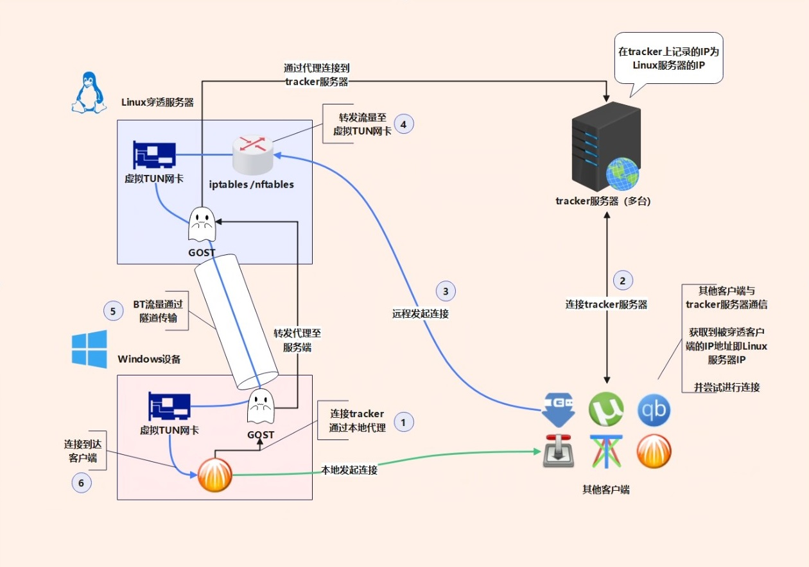

# 使用Gost替换Frp实现内网穿透为BT下载开放端口[WIP]

## 背景信息

在本教程将使用gost替代frp来为bt客户端提供穿透  
在之前的教程中我们已经实现了通过stun穿透运营商NAT  
为BT客户端开放端口 [链接](https://www.bilibili.com/read/cv31006420/)   

但是此方案只使用于全锥形的运营商NAT  
且没有配置防火墙的情况的情况  
事实上现实中的情况非常的复杂 该方案并不总是能成功  

尤其是随着对PCDN的严打  
越来越多的地方运营商使用对称形NAT和关闭IPv6的方法  
对PCDN实施打击  

这使得stun方案不再可以用  
中继方案几乎成为了开放唯一的选择  

---

## Frp 方案的弊端

frp穿透方案已广泛使用于各类场景  
其配置起来也不算是非常复杂  

尤其是在有第三方的图像界面和配置生成器辅助的情况下  
其可以胜任大部分的穿透场景  

### 源IP和端口问题

但是frp方案存在一个致命的缺陷  
**即其在应用层对流量进行转发 这会导致连接的源IP和端口号丢失**  
这样一来通过frp穿透后远程传入的流量都会变成来自本地frp客户发出的  
源地址为`127.0.0.1`的本地流量  

其实这对大部分的程序和应用来说不是个问题 毕竟只要连接可以接通就行了  
至于来源是来着本地还是远程并不重要  

但对BT客户端来说情况就不一样了  
这样一来在BT客户端中显示的其他用户的IP地址都会变成本地环回地址  
当然如果只是看起来有些奇怪 倒也无妨  

**更大的问题是这会影响反吸血的效果**  
确切的来讲是类似于[PBH](https://github.com/PBH-BTN/PeerBanHelper)的较为复杂的外置反吸血程序  
像比特彗星和其他一些客户端中所内置的较为简单的反吸血功能不太会受影响  

这又要从PCDN问题开始讲了  
简而言之这个和PCDN所使用的刷流方法有关系  

其会在同一IP不同端口上发起多个线程进行下载  
并丢弃下载到的数据 因为他们的目的只是提高自己宽带下载流量   
关于PCDN刷流对BT反吸血带来了新的挑战在之后的文章可能会进行讲解   

而在通过frp转发后所有用户的源IP都会变成本地地址  
**使得外置反吸血程序无法识别这些多个线程刷流行为**  

### 附加代理问题

在使用frp转发BT流量的基础上  
我们还需要为BT客户端设置代理  
这和BT客户端向 tracker 的汇报有关系  

若不通过代理连接tracker服务器 则在tracker服务器上  
记录的仍然是**客户端所在的本地对外IP** 而非穿透服务器的IP  
这样一来其他客户端在连接的时候依然会其他客户端依然会尝试连接这个本地对外IP  
而非可以连接的穿透服务器IP  

所以让bt客户端通过代理来连接tracker服务器是必要的  
frp本身并不支持代理功能 需要安装其他的代理服务端程序  

---

## Gost方案所解决的问题

相比起frp方案存在的这些弊端  
Gost方案可以有效避免这些问题  

Gost使用go语言编写 集成了非常多的网络功能  
官方文档：链接

### 可保留源IP

事实上本方案中不使用gost的自身的端口转发功能  
其本质上也是在应用层进行转发 也会造成源IP丢失  

流量转发功能由iptable或nftable承担  
gost负责建立隧道和创建虚拟网卡  

将gost和iptable或nftable配合使用可以达到  
类似于传统VPN的效果 但又不完全一样  

其实frp也支持传递原始IP 但依靠的是 [Proxy Protocol](http://www.haproxy.org/download/1.8/doc/proxy-protocol.txt) 实现的  
其应该是通过在标准的TCP首部之前插入额外的字段来传递真实IP  
**这需要穿透后的客户端支持解析这些额外字段**  
如果客户端不支持解析这部分内容 那连接便会发生错误  

而使用iptable或nftable的转发过程  
对应用程序来说是透明的 客户端程序无需做任何额外的适配  

这也使得此方案不仅适用于BT下载穿透  
也适用于其他需要保留源IP地址的场景  

### 集成代理功能

Gost集成了代理功能 其中包括socks5  
这样一来UDP tracker和 http(s) tracker 都可以通过代理连接  

除此之外其还支持一定的**分流功能**  
可以实现在连接IPv4 tracker 服务器时通过代理  
而在连接IPv6 tracker时则通过本地发起  
这在本地有IPv6且端口开的时候非常有用  

### 更高的转发效率

相比起frp自身的转发功能 由iptable或nftable进行转发 效率会更高  
gost的隧道部分则是基于 wireguard-go 实现的 其运行在用户空间的  
这相比官方版本运行在内核wireguard 效率略低 但其仍然十分可观  

---

## 工作流程

**示意图**

### 服务端布置

Linux服务端

安装gost iptables或nftables

gost 创建虚网卡 同时建立隧道
开启socks5 代理服务端功能

### 客户端布置

Windows客户端

gost 创建虚网卡 同时建立隧道
开启socks5 作为本地代理 

必要可设置IPv6和IPv4分流
即发向IPv6 tracker的请求是否通过代理

### 详细流程