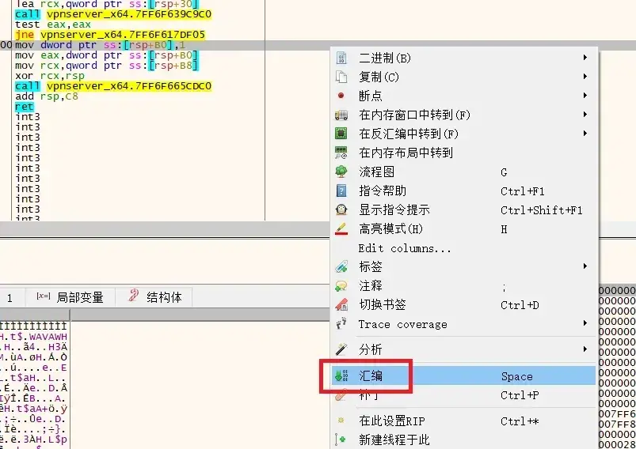
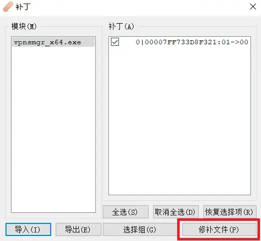

# 解决Softether开源版本中“不支持此功能。它尚未在开源版本上实施”的问题

Softether 在中国和日本有商业版贩售  
当开源版本检测到其运行在这两个地区时会自动限制部分高级功能  
如静态路由推送  


## 解决方法1 

从源代码编译  
修改`src/Cedar/Server.c`  
GitHub项目地址：[链接](https://github.com/SoftEtherVPN/SoftEtherVPN/)  

```
bool SiIsEnterpriseFunctionsRestrictedOnOpenSource(CEDAR *c)
{
    char region[128];
    bool ret = false;
    // Validate arguments
    if (c == NULL)
    {
        return false;
    }


    SiGetCurrentRegion(c, region, sizeof(region));

    if (StrCmpi(region, "JP") == 0 || StrCmpi(region, "CN") == 0)
    {
        ret = true;
    }

    return ret;
}
```
**将最后一行的 return ret 改成 return false**  

---

## 解决方法2

安装好服务端以后  
修改目录下的“vpnsmgr_x64”和“vpnserver_x64”  

使用 x64dbg 调试工具打开程序   
工具官网：https://x64dbg.com/  


两个文件都需要修改  
先打开 vpnsmgr_x64  

右键空白处>搜索>所有用户模块>字符串   


在下方搜索框中输入CN（大写）


选择第二个CN  


跳转到要修改的位置  


选中划线部分`mov dword ptr ss:[rsp+B0],1`  
右键>汇编  


将最后的0x1改成0x0  


修改成功后，开始制作补丁  


点击修补文件，选择保存位置即可输出修改后的程序  



按照相同的方法修改vpnserver_x64  
将原有的程序替换为修改好的程序即可  
替换时要先停止服务，替换完成后再启动   


---

参考：  
* https://kbssj.com/softethervpn/
* https://www.cnblogs.com/ip99/p/13991232.html