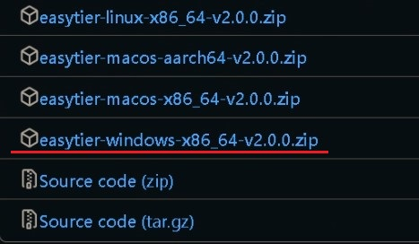
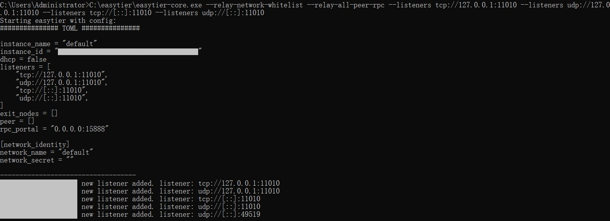
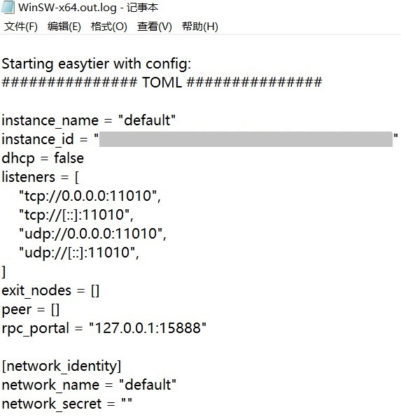
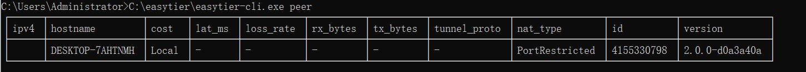

# 在Windows上搭建 EasyTier 公共服务器


## 关于本教程

本教程将介绍如何在Windows上搭建 EasyTier 公共服务器  
以帮助那些无公网的节点进行连接  

值得注意的是EasyTier是不区分客户端和服务端的 其本身同时承载  
服务端和客户端的功能  

EasyTier 在Windows上其实是有图形化界面程序的 可以用于搭建公共服务器  
不过目前图形界面可操作的参数较少 使用命令行版本可操作选项会更多  
而且其需要保持长期运行 所以使用命令行版本会更加合适  

EasyTier在下文中简称为ET  
本教程使用第三方软件将ET注册为win服务  
可以轻松实现开机自启动 无需登录账户 并且避免显示命令行窗口  

---

## 下载EasyTier

前往Github下载使用于Windows的ET命令行版本  

Github项目链接：[链接](https://github.com/EasyTier/EasyTier/releases)  

下载最后的 **easytier-windows-x86_64** 

**示例**  


下载并解压文件  
其中的 easytier-core.exe 为**程序核心**  
而easytier-cli.exe为**命令行管理工具**  

建议重命名一下文件夹 减少嵌套的文件夹层数  
让文件路径变的短一些 这会方便之后的设置  

---

## 下载WinSW

目前 ET 本身并不直接支持注册为系统服务  
我们需要第三方软件的支持 当然win其实自带将程序注册成服务的命令  
不过其并不是非常好用 使用第三方软件会更加方便 这里使用的是**WinSW**  

Github项目地址：[链接](https://github.com/winsw/winsw/releases)  
选择**WinSW-x64.exe**  

**示例**  


下载完成后将其复制到EasyTier目录下面  

---

## 编写EasyTier配置文件

### 关于配置文件

因为我们将 ET 注册为服务使用 所以通过配置文件来控制会比较方便  
当然使用参数来控制也可以 不过参数内容是win服务信息的一部分 要修改的话会比较麻烦  
需要重新注册服务 而使用配置文件的话只需要在修改后重启服务即可  

虽然官网上给出了配置文件的示例 但有部分参数的写法并没有给出  
而且手写配置文件并不方便  

**配置文件示例：**[链接](http://https://www.easytier.top/guide/network/config-file.html)
更好的方法是先使用参数启动 EasyTier 其会在控制台窗口中  
打印出对应的配置文件 将其复制下来保存即可  

搭建公共服务器部分的内容主要参照  
**官网中的教程：**[链接](https://www.easytier.top/guide/network/host-public-server.html)  


**我们此处搭建的是不转发流量只进行辅助穿透的公共服务器**  

### 确定选用参数

作为只进行辅助穿透的公共服务器 所要设置的参数其实非常少  
最基础的设置只需要加上 官网给出的附加参数即可  

```
--relay-network-whitelist --relay-all-peer-rpc
```

其余参数均会默认值 不过其默认不会监听IPv6地址  
若有修改监听端口 地址或协议的需要 可以手动指定  
例如监听 IPv4/IPv6 的 UDP/TCP 11010 端口  

```
--relay-network-whitelist --relay-all-peer-rpc --listeners tcp://127.0.0.1:11010 --listeners udp://127.0.0.1:11010 --listeners tcp://[::]:11010 --listeners udp://[::]:11010
```

更多可用参数可以查看官网信息：[链接](https://www.easytier.top/guide/network/configurations.html)
也可以通过核心中的`-h`帮助命令查看  
可通过将核心拖放到命令提示符中 实现快速输入程序路径  


**示例**  


### 保存配置文件

使用参数启动 ET 后若设置正确则可看到输出了配置信息和端口监听信息  

**示例**  


将其中的配置信息复制下来保存到EasyTier的目录下 文件名为 `config.yaml`  
（### TOML ### 和--- 之间的部分）  

**示例**  


附加`-c 配置文件路径` 的参数以使用配置文件启动  
若设置正确则可以看到和上一小节中相同的内容  
成功打印出配置文件和端口监听信息  

**示例**  

```
-c C:\easytier\config.yaml
```


---

## 设置WinSW配置文件

在设置完ET的配置文件后我们还需要设置WinSW的配置文件  
WinSW配置可设置的内容很多 但我们只需要使用部分的参数字段即可  
配置文件说明:[链接](https://github.com/winsw/winsw/blob/v3/docs/xml-config-file.md)  


在WinSW目录下创建与WinSW程序同名的xml文件  
例如使用的是WinSW-x64.exe 那要创建的配置文件名即为WinSW-x64.xml  
填入下列内容 **并按照实际情况修改**  

**示例**  

```
<service>
  <id>easytier</id>
  <name>EasyTier</name>
  <description>EasyTier公共节点服务</description>
  <executable>C:\easytier\easytier-core.exe</executable>
  <arguments>-c C:\easytier\config.yaml</arguments>
<log mode="roll-by-size">
  <sizeThreshold>4096</sizeThreshold>
  <keepFiles>2</keepFiles>
</log>
</service>
```

* **id:** 为win在实际处理服务时所识别的名称 请不要使用特殊符号 

* **name:** 为服务列表看到的服务名称  

* **description:** 为任务描述  

* **executable:** 可执行程序路径 即 ET核心的路径  

* **log mode:** 为WinSW日志的记录模式 这里使用的是 roll-by-size  
  即根据日志文件大小自动覆盖旧的日志文件  

* **sizeThreshold:** 用于控制单个日志文件的大小默认为10MB  
  此处设置为4096KB  

* **keepFiles:** 表示保留的日志文件数量 此处限制为2个  

填写好这些配置文件后就可以准备注册服务了  

---

## 注册为系统服务

准备好WinSW配置文件后我们就可以使用 `install`命令进行注册  
若显示 `installed successfully` 则表示注册成功  

**示例**  


---

## 检视效果

### 启动服务

在完成服务注册后就可以尝试启动服务了  
win搜索栏搜索 **服务** 进入服务管理工具  

找到之前注册好的 ET服务 并启动该服务  
若配置都正确则服务进入运行状态  

**示例**  


我们可以在 目录下的WinSW-x64.out.log 文件中看到  
输出了和之前在控制台中相类似的信息  

**示例**  



### 检查端口

使用在线或本地端口扫描工具检查端口（TCP） 是否已经打开  
（示例中使用的是[TCPING](https://www.elifulkerson.com/projects/tcping.php)）  

**示例**  


### 使用命令行管理工具

ET核心程序和管理工具是相分离的 在以服务运行的情况下  
没有命令行窗口 但我们依然可以使用 管理工具通过RPC查看服务核心状态  

由于是在本地运行且使用的是默认RPC端口故无需额外指定地址和端口号  
可使用`help`参数以查看管理工具的可用命令  


接着使用 `peer` 命令查看已经连接的节点  
当然现在没有连接其他节点 但可以显示出自身 表明核心已在正常运行  
节点名称默认为计算机名 如果想更改可以通过 `--hostname 主机名`进行修改  



### 故障排除

容易出现问题的部分是主要是在winSW配置文件中  
即可执行文件路径和附加参数中的路径 这两项  
若填写错误 服务在启动后会立刻停止  

我们可以从目录下的几个日志文件中查看服务情况  

除了刚才提到的**WinSW-x64.out.log**  
还有 **WinSW-x64.err.log** 和 **WinSW-x64.wrapper.log**  
通过查看日志文件 即可确定发生错误原因  


如果需要重新注册服务则需要先使用 `uninstall`命令卸载服务  
修改好配置文件后再次使用 `install`命令进行注册  

---

## 结尾

至此我们便实现了在Windows上搭建 EasyTier 公共服务器  

